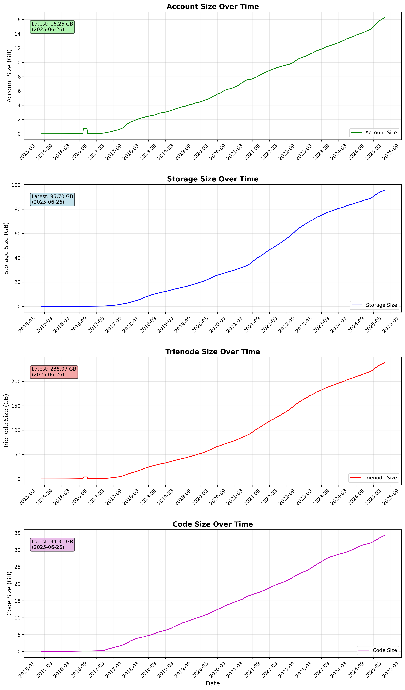
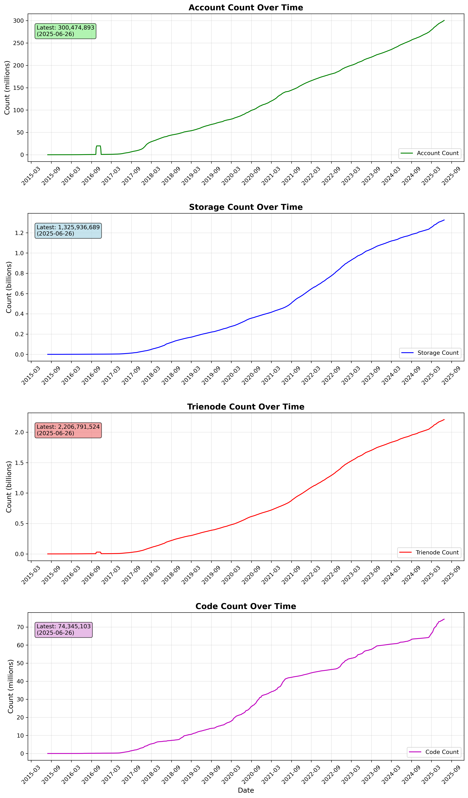

# Geth state changes over time

We aim to monitor the state changes in Geth over time, with a particular focus on the state trie. This provides valuable insights into how the Ethereum network's state evolves with each new release of Geth.
With the recent pull request [eth,core: add a state size live tracer by jsvisa · Pull Request #31914 · ethereum/go-ethereum](https://github.com/ethereum/go-ethereum/pull/31914), we now have the capability to track these changes and output them into a JSON file. This file can subsequently be utilized to generate a detailed diff of the state trie, allowing us to analyze the specific modifications and their impact on the network's state.

We can enable the state size live tracer by using the `--tracer` flag when starting Geth. The command would look like this:

```bash
geth --vmtrace=state --vmtrace.jsonconfig={"path": "/data/geth-dev-trace", "maxSize": 0}
```

It writes each block's state changes into one line, as shown below:

```
{"number":141,"hash":"0x81bfd49d2bb8800e6e3edddc0e66286bff7e3cec35d56665c5b1dae376eb005b","time":1748419461,"accounts":0,"storages":2,"trienodes":2,"codes":0,"accountSize":0,"storageSize":102,"trienodeSize":241,"codeSize":0}
{"number":142,"hash":"0x667c5618b5e7da83eae12acf08f6c0dd4844784209e47871ede6df05f5753a87","time":1748419462,"accounts":0,"storages":2,"trienodes":2,"codes":0,"accountSize":0,"storageSize":102,"trienodeSize":241,"codeSize":0}
{"number":143,"hash":"0xd7f882e1d7e770ef44f53ce083845a6d295a0ded2bebd4296299a752e71a61de","time":1748419463,"accounts":0,"storages":2,"trienodes":2,"codes":0,"accountSize":0,"storageSize":102,"trienodeSize":241,"codeSize":0}
{"number":144,"hash":"0x1f7463dc3715153b04b3bcce0fce3a1988b2f46f43166c7772644ca1cd9fea47","time":1748419464,"accounts":0,"storages":2,"trienodes":2,"codes":0,"accountSize":0,"storageSize":102,"trienodeSize":243,"codeSize":0}
{"number":145,"hash":"0x68ac80bad19b82a50a9d975bfa05f741955de867f89316630e13cbcb7ba8ce72","time":1748419465,"accounts":0,"storages":2,"trienodes":2,"codes":0,"accountSize":0,"storageSize":102,"trienodeSize":241,"codeSize":0}
```

Here are the fields explained:

- `number`: The block number.
- `hash`: The block hash.
- `time`: The timestamp of the block.
- `accounts`: The number of accounts created in this block.
- `storages`: The number of storage slots created in this block.
- `trienodes`: The number of trie nodes created in this block.
- `codes`: The number of codes created in this block.
- `accountSize`: The size of the accounts created in bytes.
- `storageSize`: The size of the storage created in bytes.
- `trienodeSize`: The size of the trie nodes created in bytes.
- `codeSize`: The size of the codes created in bytes.

### Important Note on Contract Code Storage and Measurement Discrepancies

**Contract Code Deduplication in Geth:**
Geth uses `CodePrefix + CodeHash` as the database key, where the CodeHash is derived from the contract's bytecode. This design ensures that identical bytecode is stored only once in the database, regardless of how many contracts share the same code.

**Measurement Methodology vs. Actual Storage:**
Our state size tracing framework counts contract code by individual contract addresses, which creates a discrepancy with the actual database storage:

- **Tracing Framework Count**: Each contract deployment is counted separately, even if multiple contracts share identical bytecode
- **Actual Database Storage**: Identical bytecode is deduplicated and stored only once using the hash-based key system
- **Impact**: This leads to an overestimation of code storage size in our measurements compared to the actual state trie size

And in the meanwhile, our tracing framework only counts the creation of contract code, for the selfdestructed contract are not deducated.

## Full sync from genesis

So we run Geth in full-sync from genesis, and it will output all the state changes. After we get all those JSON lines, we can load those lines into a database, and then we can query the database to get the state changes over time.

[datasets/daily-states.csv](./datasets/daily-states.csv) is a daily aggregated result of the state changes, from the result we can see the state changes over time, and we can also see the size of the state trie, which is a good indicator of the network's health.

### Size Over Time



### Count Over Time



## Results

Here we summarize the yearly state changes in Geth from 2015 to 2025, focusing on the three main categories: states (accounts + storages), trienodes, and contract codes. The data is aggregated yearly, showing the growth in GB per year for each category.

### Yearly State Size Increases (GB)

| Year | State Size | Trienode Size | Code Size |
| ---- | ---------- | ------------- | --------- |
| 2015 | 0.03       | 0.05          | 0.01      |
| 2016 | 0.18       | 0.40          | 0.16      |
| 2017 | 3.31       | 7.47          | 2.13      |
| 2018 | 10.68      | 22.63         | 3.60      |
| 2019 | 8.45       | 17.94         | 3.77      |
| 2020 | 12.26      | 26.17         | 4.30      |
| 2021 | 16.83      | 36.20         | 4.07      |
| 2022 | 22.79      | 45.77         | 4.78      |
| 2023 | 16.92      | 35.33         | 5.37      |
| 2024 | 11.28      | 26.08         | 3.63      |
| 2025 | 9.24       | 20.02         | 2.50      |

## Summary Statistics

| Category      | Total Increase | Average/Year | Max Year Increase |
| ------------- | -------------- | ------------ | ----------------- |
| State Size    | 111.97 GB      | 10.18 GB     | 22.79 GB          |
| Trienode Size | 238.07 GB      | 21.64 GB     | 45.77 GB          |
| Code Size     | 34.31 GB       | 3.12 GB      | 5.37 GB           |

> States (accounts + storages)

- **Early years:** Monthly increase < 0.05 GiB.
- **2017–2020:** Gradual increase, reaching ~0.5–0.8 GiB/month.
- **2021–2023:** Peaks above 1 GiB/month several times (notably late 2021 and 2022).
- **2024–2025:** Stabilizes around 0.5–1.3 GiB/month, with a spike to 1.28 GiB in Apr 2025.

> Trienodes

- **Consistently the largest contributor to state growth.**
- **2015–2016:** Minimal growth (<0.1 GiB/month).
- **2017–2020:** Rises to 1–2 GiB/month.
- **2021–2023:** Frequently exceeds 3 GiB/month, peaking at 4.79 GiB in Jan 2023.
- **2024–2025:** Remains high, with a major spike to 4.74 GiB in Apr 2025.

> Codes

- **Smallest but steadily increasing.**
- **2015–2016:** Near zero.
- **2017–2020:** Rises to 0.2–0.5 GiB/month.
- **2021–2025:** Generally 0.3–0.5 GiB/month, with a peak of 0.56 GiB in Apr 2025.

## Key Results and Analysis

### Growth Patterns

**1. Trienode Dominance**

- Trienodes account for **62%** of total state growth (238 GB out of 383 GB total)
- Trienode growth rate is **2.2x higher** than state data growth on average (21.64 GB vs 10.18 GB per year)
- Peak trienode growth occurred in **2022** with 45.77 GB increase

**2. State Size Growth Trajectory**

- Highest growth period: **2017-2022** (DeFi boom era)
- Peak state growth in **2022**: 22.79 GB (2.3x the average)
- Recent decline: **2023-2025** showing **29% reduction** in growth rate compared to peak years (2020-2022)

**3. Smart Contract Code Evolution**

- Steady growth with **peak in 2023** (5.37 GB) - coinciding with increased smart contract complexity
- Code size growth is the most **stable category** with lowest variance
- Total code represents **9.1%** of overall state growth, actual db storage is lower due to deduplication

### Temporal Analysis

**Growth Phases:**

1. Early years (2015–2016): Growth was negligible, minimal growth in all categories, Ethereum network is bootstrapping.
2. From 2017 onward, growth accelerates, especially for trienodes, in this period, the ICO boom and CryptoKitties caused the first major spikes in all categories.
3. From 2018 to 2020, stablecoin(e.g., USDT, DAI) growth and early DeFi(e.g., Uniswap, MakerDao) activity led to steady moderate growth in all categories.
4. From 2020 to 2022, the DeFi Summer(e.g., Uniswap, Aave, Compound) and NFT(e.g., CryptoPunks, Bored Apes, OpenSea) boom caused large, sustained spikes, especially in trienodes.
5. From 2022 to 2025, continued DeFi, Layer 2s(e.g., Optimism, Arbitrum) and bridges led to high, sometimes volatile growth in all categories.

**Year-over-Year Insights:**

- **2017**: First major growth spike (15x increase from 2016)
- **2018**: Sustained high growth despite crypto winter
- **2021-2022**: Peak ecosystem activity period
- **2024-2025**: **29% decline** in total growth compared to 2020-2022 peak period

### Resource Implications

**Storage Requirements:**

- **10-year cumulative growth**: ~378 GB across all categories
- **Average annual requirement**: ~34 GB additional storage per year
- **Trienode overhead**: Represents the largest infrastructure challenge
