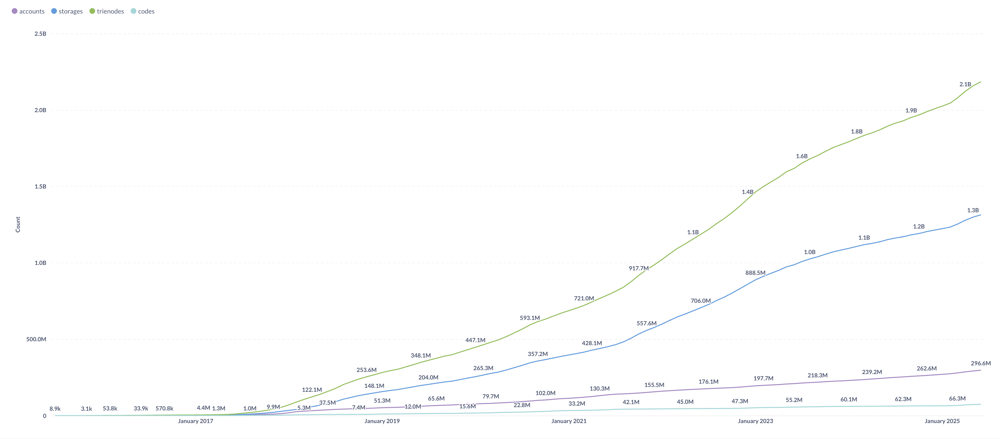
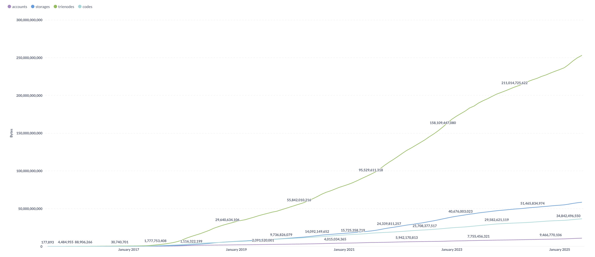
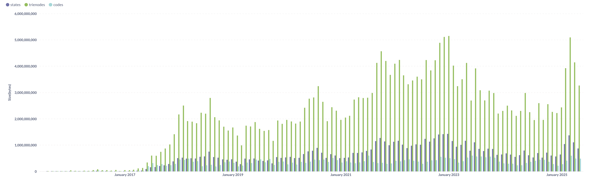

# Geth state changes over time

We aim to monitor the state changes in Geth over time, with a particular focus on the state trie.
This will provide valuable insights into how the Ethereum network's state evolves with each new release of Geth.
With the recent pull request [eth,core: add a state size live tracer by jsvisa · Pull Request #31914 · ethereum/go-ethereum](https://github.com/ethereum/go-ethereum/pull/31914), we now have the capability to track these changes and output them into a JSON file. This file can subsequently be utilized to generate a detailed diff of the state trie, allowing us to analyze the specific modifications and their impact on the network's state.

We can enable the state size live tracer by using the `--tracer` flag when starting Geth. The command would look like this:

```bash
geth --vmtrace=state --vmtrace.jsonconfig={"path": "/data/geth-dev-trace", "maxSize": 0}
```

It will write each block's state changes into one line, like below:

```
{"number":141,"hash":"0x81bfd49d2bb8800e6e3edddc0e66286bff7e3cec35d56665c5b1dae376eb005b","time":1748419461,"accounts":0,"storages":2,"trienodes":2,"codes":0,"accountSize":0,"storageSize":102,"trienodeSize":241,"codeSize":0}
{"number":142,"hash":"0x667c5618b5e7da83eae12acf08f6c0dd4844784209e47871ede6df05f5753a87","time":1748419462,"accounts":0,"storages":2,"trienodes":2,"codes":0,"accountSize":0,"storageSize":102,"trienodeSize":241,"codeSize":0}
{"number":143,"hash":"0xd7f882e1d7e770ef44f53ce083845a6d295a0ded2bebd4296299a752e71a61de","time":1748419463,"accounts":0,"storages":2,"trienodes":2,"codes":0,"accountSize":0,"storageSize":102,"trienodeSize":241,"codeSize":0}
{"number":144,"hash":"0x1f7463dc3715153b04b3bcce0fce3a1988b2f46f43166c7772644ca1cd9fea47","time":1748419464,"accounts":0,"storages":2,"trienodes":2,"codes":0,"accountSize":0,"storageSize":102,"trienodeSize":243,"codeSize":0}
{"number":145,"hash":"0x68ac80bad19b82a50a9d975bfa05f741955de867f89316630e13cbcb7ba8ce72","time":1748419465,"accounts":0,"storages":2,"trienodes":2,"codes":0,"accountSize":0,"storageSize":102,"trienodeSize":241,"codeSize":0}
```

Here are the fields explained:

- `number`: The block number.
- `hash`: The block hash.
- `time`: The timestamp of the block.
- `accounts`: The number of accounts created in this block.
- `storages`: The number of storage slots created in this block.
- `trienodes`: The number of trie nodes created in this block.
- `codes`: The number of codes created in this block.
- `accountSize`: The size of the accounts created in bytes.
- `storageSize`: The size of the storage created in bytes.
- `trienodeSize`: The size of the trie nodes created in bytes.
- `codeSize`: The size of the codes created in bytes.

So we run Geth in full-sync from genesis, and it will output all the state changes, after we get all those json lines, we can load those lines into a database, and then we can query the database to get the state changes over time.

[datasets/monthly-state-snapshot.csv](./datasets/monthly-state-snapshot.csv) is a monthly aggrgated result of the state changes, from the result we can see the state changes over time, and we can also see the size of the state trie, which is a good indicator of the network's health.

> Count Over Time



> Size Over Time



> Monthly incrasing of state and trie



## Results

### 5. **Notable Spikes and Events**

- **Late 2021–2022:** All categories see higher growth, possibly due to network activity or upgrades.
- **Apr 2025:** All categories spike, especially trienodes and states.
- **Occasional dips** (e.g., Dec 2023) but overall trend is upward.

### 6. **Recent 18 Months (2024–2025)**

- **States:** 0.49–1.28 GiB/month (average ~0.7 GiB).
- **Trienodes:** 1.82–4.74 GiB/month (average ~2.7 GiB).
- **Codes:** 0.20–0.56 GiB/month (average ~0.34 GiB).
- **Apr 2025** is the highest month for all three.

### 7. **Implications**

- **Trienodes are the main driver of state growth** and thus the main concern for node storage and performance.
- **States and codes** are growing steadily, reflecting ongoing account/storage and contract creation.
- **Sustained growth** means node operators must plan for increasing storage needs.

### 8. **Summary Table **

Here we summarize the monthly state changes in Geth from 2015 to 2025, focusing on the three main categories: states (accounts + storages), trienodes, and codes.
The data is aggregated monthly, showing the growth in GiB per month for each category.

| Year | States (GiB/mo) | Trienodes (GiB/mo) | Codes (GiB/mo) |
| ---- | --------------- | ------------------ | -------------- |
| 2015 | 0               | 0                  | 0              |
| 2016 | 0.01            | 0.03               | 0.01           |
| 2017 | 0.13            | 0.46               | 0.14           |
| 2018 | 0.49            | 1.92               | 0.31           |
| 2019 | 0.4             | 1.47               | 0.32           |
| 2020 | 0.6             | 2.18               | 0.35           |
| 2021 | 0.76            | 2.86               | 0.33           |
| 2022 | 1.06            | 3.74               | 0.39           |
| 2023 | 0.9             | 3.16               | 0.46           |
| 2024 | 0.59            | 2.18               | 0.31           |
| 2025 | 0.87            | 3.27               | 0.38           |

> **States (accounts + storages)**

- **Early years:** Monthly increase < 0.05 GiB.
- **2017–2020:** Gradual increase, reaching ~0.5–0.8 GiB/month.
- **2021–2023:** Peaks above 1 GiB/month several times (notably late 2021 and 2022).
- **2024–2025:** Stabilizes around 0.5–1.3 GiB/month, with a spike to 1.28 GiB in Apr 2025.

> **Trienodes**

- **Consistently the largest contributor to state growth.**
- **2015–2016:** Minimal growth (<0.1 GiB/month).
- **2017–2020:** Rises to 1–3 GiB/month.
- **2021–2023:** Frequently exceeds 3 GiB/month, peaking at 4.79 GiB in Jan 2023.
- **2024–2025:** Remains high, with a major spike to 4.74 GiB in Apr 2025.

> **Codes**

- **Smallest but steadily increasing.**
- **2015–2016:** Near zero.
- **2017–2020:** Rises to 0.2–0.5 GiB/month.
- **2021–2025:** Generally 0.3–0.5 GiB/month, with a peak of 0.56 GiB in Apr 2025.

Key points:

1. Early years (2015–2016): Growth was negligible, with monthly increases close to zero.
2. From 2017 onward, growth accelerates, especially for trienodes, in this period, the ICO boom and CryptoKitties caused the first major spikes in all categories.
3. From 2018 to 2020, stablecoin(e.g., USDT, DAI) growth and early DeFi(e.g., Uniswap, MakerDao) activity led to steady moderate growth in all categories.
4. From 2020 to 2022, the DeFi Summer(e.g., Uniswap, Aave, Compound) and NFT(e.g., CryptoPunks, Bored Apes, OpenSea) boom caused large, sustained spikes, especially in trienodes.
5. From 2022 to 2025, continued DeFi, Layer 2s(e.g., Optimism, Arbitrum) and bridges led to high, sometimes volatile growth in all categories.
