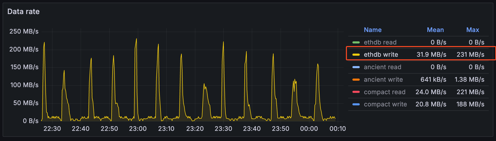

# Pebble Read Performance Based on Geth's Workflow

From [pebble.md](./pebble.md), we know that Pebble's performance varies based on different configurations. This document focuses on Pebble's read performance in the context of Geth's workflow.

## Geth's Workflow

We use `geth import` to simulate the block insertion process and analyze Pebble's performance during this operation.

**Note**: Currently, Geth doesn't have built-in database performance metrics. We've added metrics to Pebble and use [jsvisa/go-ethereum at state-reader-metric](https://github.com/jsvisa/go-ethereum/tree/state-reader-metric) to monitor performance.

The `geth import` command is configured as follows:

```bash
./bin/geth import \
    --db.engine=pebble \
    --datadir=data-base-xm \
    --cache=80960 \
    --cache.database=20 \
    --cache.snapshot=20 \
    --cache.gc=1 \
    --cache.trie=50 \
    --metrics --metrics.addr=0.0.0.0 --metrics.port=7540 \
    --state.scheme=path \
    --history.transactions=235000 \
    --history.state=90000 \
    --nocompaction \
    /hdd/geth-export-full/geth.blocks.0m-1m.gz \
    /hdd/geth-export-full/geth.blocks.1m-2m.gz \
    ...
    >> logs/import.log 2>&1
```

The host has 128GB of memory, with 80GB allocated as follows:

- Pebble DB cache: 16GB (20% of 80GB)
- Snapshot fastcache: 16GB (20% of 80GB)
- Trie pathdb fastcache: 40GB (50% of 80GB)

We use the [grafana/geth-pebble.json](./grafana/geth-pebble.json) dashboard to monitor performance metrics. Here are the key findings from the Geth import process:

### Blockchain Metrics

> Chain Insertion Time


The mean chain insertion time is 78.8ms, with a maximum of 593ms.

> Phase Timing Breakdown


| Phase           | Time (ms) | Percentage |
| --------------- | --------- | ---------- |
| storage read    | 22.0      | 34%        |
| execution       | 21.0      | 32%        |
| account read    | 12.3      | 19%        |
| storage update  | 2.90      | 4%         |
| account update  | 2.01      | 3%         |
| chain write     | 1.45      | 2%         |
| snapshot commit | 0.96      | 1%         |
| state commit    | 0.91      | 1%         |
| validation      | 0.86      | 1%         |
| account hash    | 0.74      | 1%         |

The analysis shows that 53% of the time (34% + 19%) is spent on storage and account reads, making these areas prime candidates for performance optimization.

For storage reads, we observe:

- Mean read time: 22ms
- Minimum time: 5.32ms
- Maximum time: 216ms

The significant variation in read times indicates potential optimization opportunities.

### State Metrics

The state reader in Geth uses a CachingDB that combines readers from multiple sources:

1. Snapshot flat reader
2. Trie hashdb/pathdb reader

The implementation can be found in [core/state/database.go](https://github.com/ethereum/go-ethereum/blob/2c52922ab4567a8cccd63ced2e88e892123072c4/core/state/database.go#L175-L209):

```go
func (db *CachingDB) Reader(stateRoot common.Hash) (Reader, error) {
    var readers []StateReader

    // Set up the state snapshot reader if available
    if db.snap != nil {
        snap := db.snap.Snapshot(stateRoot)
        if snap != nil {
            readers = append(readers, newFlatReader(snap))
        }
    } else {
        reader, err := db.triedb.StateReader(stateRoot)
        if err == nil {
            readers = append(readers, newFlatReader(reader))
        }
    }

    tr, err := newTrieReader(stateRoot, db.triedb, db.pointCache)
    if err != nil {
        return nil, err
    }
    readers = append(readers, tr)

    combined, err := newMultiStateReader(readers...)
    if err != nil {
        return nil, err
    }
    return newReader(newCachingCodeReader(db.disk, db.codeCache, db.codeSizeCache), combined), nil
}
```

We track read depth using metrics in [core/state/reader.go](https://github.com/ethereum/go-ethereum/blob/2c52922ab4567a8cccd63ced2e88e892123072c4/core/state/reader.go#L344-L360):

```go
func (r *multiStateReader) Storage(addr common.Address, slot common.Hash) (common.Hash, error) {
    var errs []error
    count := 0
    defer func() {
        counter := metrics.GetOrRegisterCounter(fmt.Sprintf("state/read/storage/%d", count), nil)
        counter.Inc(1)
    }()
    for _, reader := range r.readers {
        count++
        slot, err := reader.Storage(addr, slot)
        if err == nil {
            return slot, nil
        }
        errs = append(errs, err)
    }
    return common.Hash{}, errors.Join(errs...)
}
```

In our test case, all data was returned from `read 1`, indicating that all storage and account data came from the snapshot flat reader.

The snapshot consists of three layers:

1. Diff layer (most recent 128 block states)
2. Disk layer fast cache (LRU cache)
3. On-disk rawdb (Pebble DB)

Read distribution charts:

> Account Read Distribution


> Storage Read Distribution


Only 3.14% of account reads and 8.79% of storage reads hit the on-disk rawdb, with most data being served from the diff layer and disk layer fast cache.

### Ethdb (Pebble) Metrics

The [ethdb/pebble](https://github.com/ethereum/go-ethereum/tree/master/ethdb/pebble) implementation provides detailed metrics for monitoring Pebble's workflow and performance.

Read and write request distribution:


| Metric name | Mean(ops) | Min(ops) | Max(ops) |
| ----------- | --------- | -------- | -------- |
| write       | 61.5      | 9.44     | 100      |
| read 200    | 3130      | 585      | 6220     |
| read 404    | 2800      | 392      | 5720     |

Note: `read 200` indicates successful key lookups, while `read 404` indicates key not found.

Key observations:

1. Read operations (both 200 and 404) are significantly more frequent than writes (approximately 3100:1 ratio)
2. The frequency of successful and failed reads is similar

Latency metrics:

> Write Latency


> Read 200 Latency


> Read 404 Latency


| Metric name | Mean(μs) | Min(μs) | Max(μs) |
| ----------- | -------- | ------- | ------- |
| write       | 25.5     | 17.5    | 42.8    |
| read 200    | 113      | 24.8    | 2300    |
| read 404    | 41.5     | 9.43    | 90.2    |

Key findings:

1. Write latency is consistently low (25.5μs) due to `sync: false` write options
2. Read latency is significantly higher than write latency
3. Read 200 latency shows high variability, indicating potential optimization opportunities
4. Read 404 latency remains stable

Write bandwidth metrics:



- Mean write bandwidth: 32MB/s
- Peak write bandwidth: 231MB/s

## Pebble Read Benchmark

Our initial read benchmark used a stable database without writes, which doesn't accurately reflect Geth's workload. We need to simulate a more realistic scenario:

1. Initialize the database with a substantial size (e.g., 200GB) using key-value sizes similar to Geth's
2. Benchmark read performance with 50% existing keys and 50% non-existent keys
3. Run a sidecar write thread to simulate database mutations at Geth-like speeds
4. Measure read performance under these conditions

### 1. Database Initialization

Analysis of Geth's key-value pairs using [cmd/db-iterator](https://github.com/jsvisa/go-ethereum/blob/db-iterator/cmd/db-iterator/analyze.py) shows:

Key length distribution:

| Length | Count      | Percentage |
| ------ | ---------- | ---------- |
| 33     | 3044938260 | 47.52      |
| 65     | 1255816825 | 19.60      |
| 38     | 405770871  | 6.33       |
| 37     | 398349989  | 6.22       |
| 39     | 353845432  | 5.52       |
| 36     | 210959913  | 3.29       |
| 8      | 173793595  | 2.71       |
| 9      | 172056223  | 2.69       |
| 40     | 158045169  | 2.47       |
| 35     | 83748492   | 1.31       |

Value length distribution:

| Length | Count      | Percentage(%) | Cumulative(%) |
| ------ | ---------- | ------------- | ------------- |
| <16b   | 3762937229 | 58.74         | 58.74         |
| <64b   | 1623984858 | 25.34         | 84.08         |
| <128b  | 855029504  | 13.33         | 97.41         |
| <1kb   | 164608814  | 2.51          | 99.92         |
| <1mb   | 466160     | 0.00          |               |
| <4kb   | 351524     | 0.00          |               |
| <8kb   | 391346     | 0.00          |               |
| >1mb   | 2          | 0.00          |               |

Most keys are 33 or 65 bytes (snapshot keys, transaction lookups, block hashes), and most values are less than 16 bytes.

We initialize the database with 65-byte keys and 3-5 byte values:

```bash
pdb-writebench -keysize 65b -valuesize 3 -dir /md0/pb-dataset -test batch-100kb-mt-1gb-cache-04gb -size 100gb -keydir /md1/pb-keys -logdir pb-testlogs
pdb-writebench -keysize 65b -valuesize 4 -dir /md0/pb-dataset -test batch-100kb-mt-1gb-cache-04gb -size 100gb -keydir /md1/pb-keys -logdir pb-testlogs
pdb-writebench -keysize 65b -valuesize 5 -dir /md0/pb-dataset -test batch-100kb-mt-1gb-cache-04gb -size 100gb -keydir /md1/pb-keys -logdir pb-testlogs
```

### 2. Sidecar Write Process

```bash
pdb-readbench -keysize 65b -valuesize 128b -keydir /md1/pb-keys/batch-100kb-mt-1gb-cache-04gb -logdir pebble-read-logs -dir /md0/pb-dataset/testdb-batch-100kb-mt-1gb-cache-04gb/ -size 10mb -keyrandom 50 -test geth-read-cache-02gb,random-read-cache-02gb,pebble-read-cache-02gb
```

Note: `--valuesize 128b` specifies the maximum value length, with actual values randomly generated between 1 and 128 bytes.
