# Pebble Read Performance Based on Geth's Workflow

From [pebble.md](./pebble.md), we know that Pebble's performance varies based on different configurations. This document focuses on Pebble's read performance in the context of Geth's workflow.

## Geth's Workflow

We use `geth import` to simulate the block insertion process and analyze Pebble's performance during this operation.

**Note**: Currently, Geth doesn't have built-in database performance metrics. We've added metrics to Pebble and use [jsvisa/go-ethereum at state-reader-metric](https://github.com/jsvisa/go-ethereum/tree/state-reader-metric) to monitor performance.

The `geth import` command is configured as follows:

```bash
./bin/geth import \
    --db.engine=pebble \
    --datadir=data-base-xm \
    --cache=80960 \
    --cache.database=20 \
    --cache.snapshot=20 \
    --cache.gc=1 \
    --cache.trie=50 \
    --metrics --metrics.addr=0.0.0.0 --metrics.port=7540 \
    --state.scheme=path \
    --history.transactions=235000 \
    --history.state=90000 \
    --nocompaction \
    /hdd/geth-export-full/geth.blocks.0m-1m.gz \
    /hdd/geth-export-full/geth.blocks.1m-2m.gz \
    ...
    >> logs/import.log 2>&1
```

The host has 128GB of memory, with 80GB allocated as follows:

- Pebble DB cache: 16GB (20% of 80GB)
- Snapshot fastcache: 16GB (20% of 80GB)
- Trie pathdb fastcache: 40GB (50% of 80GB)

We use the [grafana/geth-pebble.json](./grafana/geth-pebble.json) dashboard to monitor performance metrics. Here are the key findings from the Geth import process:

### Blockchain Metrics

> Chain Insertion Time


The mean chain insertion time is 78.8ms, with a maximum of 593ms.

> Phase Timing Breakdown


| Phase           | Time (ms) | Percentage |
| --------------- | --------- | ---------- |
| storage read    | 22.0      | 34%        |
| execution       | 21.0      | 32%        |
| account read    | 12.3      | 19%        |
| storage update  | 2.90      | 4%         |
| account update  | 2.01      | 3%         |
| chain write     | 1.45      | 2%         |
| snapshot commit | 0.96      | 1%         |
| state commit    | 0.91      | 1%         |
| validation      | 0.86      | 1%         |
| account hash    | 0.74      | 1%         |

The analysis shows that 53% of the time (34% + 19%) is spent on storage and account reads, making these areas prime candidates for performance optimization.

For storage reads, we observe:

- Mean read time: 22ms
- Minimum time: 5.32ms
- Maximum time: 216ms

The significant variation in read times indicates potential optimization opportunities.

### State Metrics

The state reader in Geth uses a CachingDB that combines readers from multiple sources:

1. Snapshot flat reader
2. Trie hashdb/pathdb reader

The implementation can be found in [core/state/database.go](https://github.com/ethereum/go-ethereum/blob/2c52922ab4567a8cccd63ced2e88e892123072c4/core/state/database.go#L175-L209).

And the snapshot consists of three layers:

1. Diff layer (the most recent 128 block states)
2. Disk layer fast cache (LRU cache)
3. On-disk rawdb (Pebble DB)

Read distribution charts:

> Account Read Distribution


> Storage Read Distribution


**Only 3.14% of account reads and 8.79% of storage reads hit the on-disk rawdb, with most data being served from the diff layer and disk layer fast cache.**

### Ethdb (Pebble) Metrics

The [ethdb/pebble](https://github.com/ethereum/go-ethereum/tree/master/ethdb/pebble) implementation provides detailed metrics for monitoring Pebble's workflow and performance.

Read and write request distribution:


| Metric name | Mean(ops) | Min(ops) | Max(ops) |
| ----------- | --------- | -------- | -------- |
| write       | 61.5      | 9.44     | 100      |
| read 200    | 3130      | 585      | 6220     |
| read 404    | 2800      | 392      | 5720     |

Note: `read 200` indicates the key was retrieved in the db, while `read 404` indicates the key was not found.

Key observations:

1. Read operations (both 200 and 404) are significantly more frequent than writes (approximately 3100 times)
2. The frequency of successful and failed reads are roughly equal to 1:1

#### Ethdb latency breakdown

Here comes the latency of each operation:

> Write Latency


> Read 200 Latency


> Read 404 Latency


| Metric name | Mean(μs) | Min(μs) | Max(μs) |
| ----------- | -------- | ------- | ------- |
| write       | 25.5     | 17.5    | 42.8    |
| read 200    | 113      | 24.8    | 2300    |
| read 404    | 41.5     | 9.43    | 90.2    |

Key findings:

1. Write latency is consistently low (25.5μs) due to `sync: false` write options
2. Read latency is significantly higher than the write latency
3. Read 200 latency shows high variability, indicating potential optimization opportunities
4. Read 404 latency remains stable

In the meanwhile, we found that the read 200 latency seems has some relationship with the pebble compaction count:


When compaction occurs, a large number of SST files need to be read and written to the next level, which consumes a lot of disk I/O bandwidth, and results in insufficient I/O for reading.

In our subsequent optimization process, we can consider how to reduce compaction, eg:

1. How to decrease the number of SST files that are required for each compaction?
2. Whether it is possible to perform compaction more quickly and smoothly?
3. Whether it is feasible to limit the bandwidth for read and compaction operations, eg: separate them into different read and write queues.

#### Ethdb write bandwidth

Here is the write bandwidth metrics, which is calculated by the bytes flushed - bytes compacted. This metric is roughly equivalent to the amount of data written to the raw database.


Key findings:

- Mean write bandwidth: 11MB/s
- Peak write bandwidth: 49MB/s
- The data writing is uneven, on avarage, there will be a peak period of writing every 10minuts or so

## Pebble Read Benchmark

Our initial read benchmark used a stable database without writes, which doesn't accurately reflect Geth's workload. We need to simulate a more realistic scenario:

1. Initialize the database with a substantial size (e.g., 100GB) using key-value sizes similar to Geth's
2. Benchmark read performance with 50% existing keys and 50% non-existent keys
3. Run a sidecar write thread to simulate database mutations
4. Measure read performance under these conditions
5. Increase the db size to 500GB, 2TB and continue the actions before.

### 0. Database Initialization

We can use `geth db inspect` to have a peek of the db distribution in the geth chaindb, this is a result of a running ethereum mainnet [@block 2025-05-06](http://etherscan.io/block/22421889), the result is https://hackmd.io/@jsvisa/HJ2shlweeg, we pay attention to the snapshot parts:

| Category         | Total Size | Count      | Avg Value Size |
| ---------------- | ---------- | ---------- | -------------- |
| Account snapshot | 13.17GiB   | 287454824  | 16B            |
| Storage snapshot | 92.56GiB   | 1282940697 | 12B            |

- Account snapshot key length is 33: `13.17*1024*1024*1024/287454824-33 = 16.194 `
- Storage snapshot key length is 65: `92.56*1024*1024*1024/1282940697-65 = 12.467 `

So we first run the `pdb-writebench` as below:

```bash
pdb-writebench -keysize 65b -valuesize 16b -dir /md0/pb-dataset -test geth-default -size 100gb -keydir /md1/pb-keys -logdir pb-testlogs
```

Key arguments:

1. `-keysize 65B` Key-Value key size as 65 bytes
2. `-valuesize 16B` Key-Value value size as 16bytes
3. `-size 100gb` Write 100GB of key-value pairs into the PebbleDB
4. `-test geth-default` Use [geth's configuration](https://github.com/ethereum/go-ethereum/blob/master/ethdb/pebble/pebble.go#L190) for writing

### 1. 100GB test

After the write process(about 2hours), we go about 116GB data in the database, so the SpaceAmp is 1.16;

#### read-only

Now let's start with db read-only mode test on that db:

```bash
pdb-readbench -keysize 65b -keydir /md2/pb-keys/geth-default -logdir pebble-read-logs -dir /md0/pb2/testdb-geth-default -size 100mb -keyrandom 50 -test geth-default
```

> Read QPS


> Read Latency


> Compaction count
>
> 

Key findings:

1. Initially,the read latency was poor.This may have been due to the fact that the database had just been initialized,and the read operations triggered compaction.As a result,the majority of the I/O bandwidth was consumed by the compaction process.
2. After the initial setup,the read performance became more stable.The variance in read latency was minimal,with an average read time of **130us** consistency was observed, regardless of whether the key being queried existed or was not found in the database.

#### read-write

Then test with the read-write mode

```bash
pdb-readbench -keysize 65b -keydir /md2/pb-keys/geth-default -logdir pebble-read-logs -dir /md0/pb2/testdb-geth-default -size 100mb -keyrandom 50 -test geth-default -sidewrite -valuesize 1kb
```

In this test case,we append the `-sidewrite -valuesize 1kb` parameters to the command line.

This will launch a goroutine to write data into the testing database. Specifically, the goroutine will write 1KB of data into the database at a rate of 100 requests per second. Additionally, every minute it will perform a burst write of 500 MB of data into the database.

> The write bandwidth is about 9mb/s:
>
> 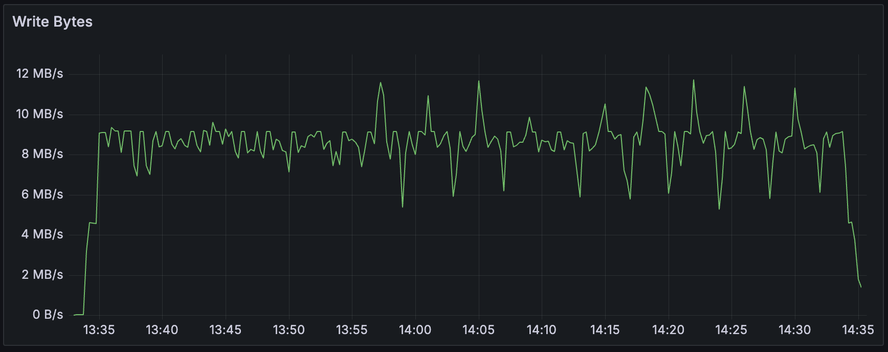

**After the write process, the db reached to 147GB**

> Read QPS
>
> 

> Read latency


Key findings:

1. Compared to the read-only mode, in read-write, the read latency is worse, the latency degraded from **130us** to **360us**

### 500GB test

Now let's fill more data into that db

Key findings:

1. The read latency(~200-500us) for all the three test cases are all larger then the previous ones.(~150-200us)
2. The write is stable, which is not similar to geth's workflow, so need to take some adjusts

We introduce a burst write inside the side write, which will trigger a 500mb write every 5minutes(later changed this interval to every 1minute), then retest it with a large write valuesize:

```bash
pdb-readbench -sidewrite -keysize 65b -valuesize 2mb -keydir /md1/pb-keys/batch-100kb-mt-1gb-cache-04gb -logdir pebble-read-logs -dir /md0/pb-dataset/testdb-batch-100kb-mt-1gb-cache-04gb/ -size 10mb -keyrandom 50 -test geth-read-cache-02gb,pebble-read-cache-02gb,random-read-cache-02gb
```

The write QPS and latency as below:

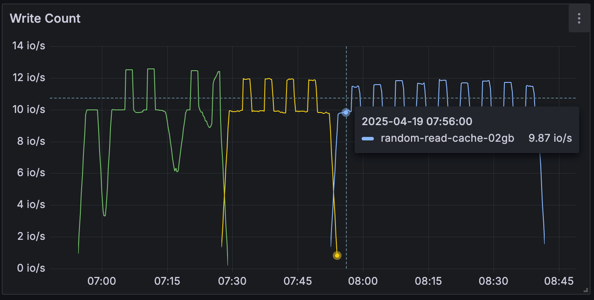

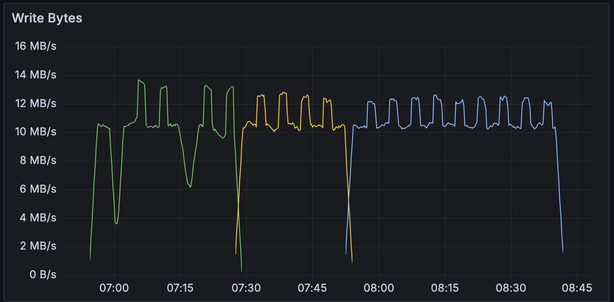

Read QPS and latency as below:

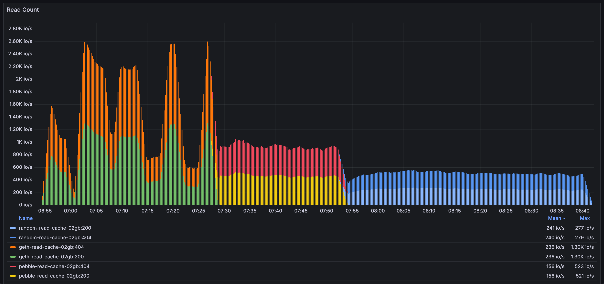

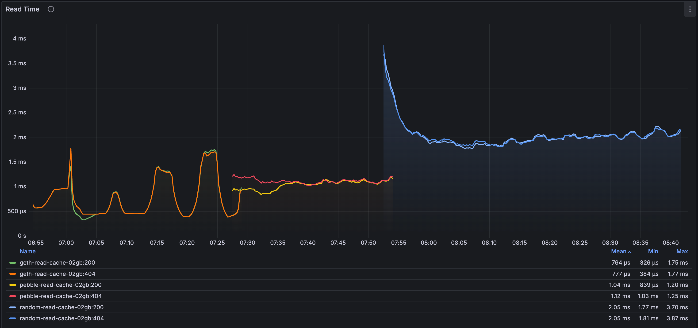

Key findings:

1. The read latency is 500us-1ms, which is 2times more compared to the previous testcase.

In the mean while, let's test the db in read-only mode without the `-sidewrite` :

```bash
pdb-readbench -keydir /md1/pb-keys/batch-100kb-mt-1gb-cache-04gb -logdir pebble-read-logs -dir /md0/pb-dataset/testdb-batch-100kb-mt-1gb-cache-04gb/ -size 10mb -keyrandom 50 -test geth-read-cache-02gb

# pebble manually compaction ~30mins

pdb-readbench -keydir /md1/pb-keys/batch-100kb-mt-1gb-cache-04gb -logdir pebble-read-logs -dir /md0/pb-dataset/testdb-batch-100kb-mt-1gb-cache-04gb/ -size 10mb -keyrandom 50 -test geth-read-cache-02gb
```

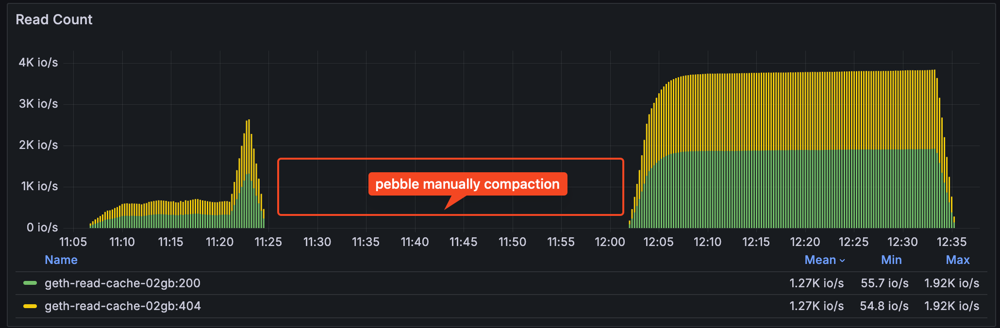

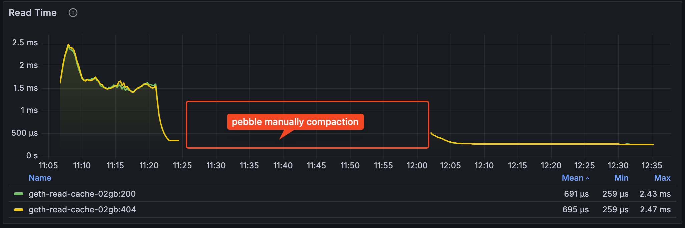

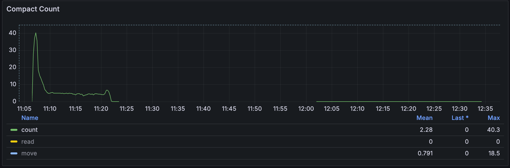

Key points:

1. Pre compaction, the read performance is not stable, but increases at the end of the first read phase, maybe the previous reads triggered the db compaction
2. Post compaction, the read latency is really low after the compaction, about 7 times lower compared the pre compaction

Apart from the 3-5 byte state db, we also write a bunch of data ranging from 0 to 128kb to simulate the block data.

```bash
pdb-writebench -keysize 65b -valuesize 10kb -dir /md0/pb-dataset -test batch-100kb-mt-1gb-cache-04gb -size 100gb -keydir /md1/pb-keys -logdir pb-testlogs
pdb-writebench -keysize 65b -valuesize 64kb -dir /md0/pb-dataset -test batch-100kb-mt-1gb-cache-04gb -size 100gb -keydir /md1/pb-keys -logdir pb-testlogs
pdb-writebench -keysize 65b -valuesize 128kb -dir /md0/pb-dataset -test batch-100kb-mt-1gb-cache-04gb -size 100gb -keydir /md1/pb-keys -logdir pb-testlogs
```

After this write process, we first manually compact the db, and then got about 900GB data in the database.

```bash
du -sh /md0/pb-dataset
900GB
```

So here we can start the read process to see how is it the read performance

```bash
pdb-readbench -keysize 65b -keydir /md1/pb-keys/batch-100kb-mt-1gb-cache-04gb -logdir pebble-read-logs -dir /md0/pb-dataset/testdb-batch-100kb-mt-1gb-cache-04gb/ -size 100mb -keyrandom 50 -test geth-read-cache-02gb,pebble-read-cache-02gb,random-read-cache-02gb
```

> Read QPS

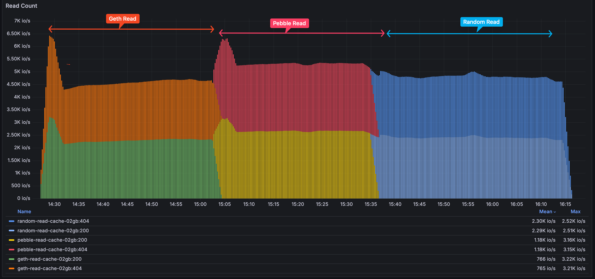

> Read Latency

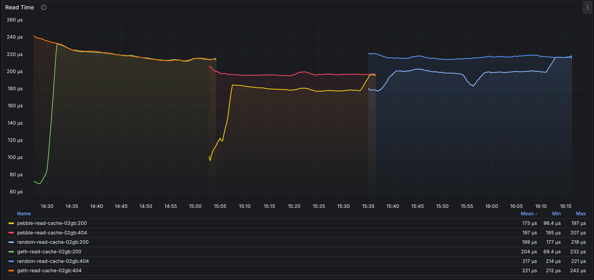

Key findings:

1. After compaction, the latency of DB read is relatively stable, and there is no significant relationship between the reading time and the size of the DB.

### Large dbsize test

In order to better test the scalability of Pebble, we wrote the data to the database up to 3TB(my ssd is 3.6TB), and then test it's read performance.

We need to test based on geth's default pebble configuration, add the more test cases as below, ref https://github.com/jsvisa/goleveldb-bench/blob/5cccbcf5d23aca3a74713ce104691aee540b9292/cmd/pdb-readbench/pdb-readbench.go#L181-L387:

```go
- geth-default
- geth-MemTableSize-64mb
- geth-L0StopWritesThreshold-1000
- geth-L0CompactionThreshold-4
- geth-L0CompactionThreshold-12
- geth-level-BlockSize-32kb
- geth-level-BlockSize-32kb-IndexBlockSize-256kb
- geth-FlushSplitBytes-2mb
```

#### 3TB + sidewrite

First test with `-sidewrite` and without db compaction:

```bash
pdb-readbench -sidewrite -keysize 65b -valuesize 1kb -keydir /md1/pb-keys/batch-100kb-mt-1gb-cache-04gb -logdir pebble-read-logs -dir /md0/pb-dataset/testdb-batch-100kb-mt-1gb-cache-04gb/ -size 10mb -keyrandom 50 -test geth-FlushSplitBytes-2mb,geth-L0CompactionThreshold-4,geth-L0StopWritesThreshold-1000,geth-MemTableSize-64mb,geth-default,geth-level-BlockSize-32kb,geth-level-BlockSize-32kb-IndexBlockSize-256kb
```

> The read count and latency

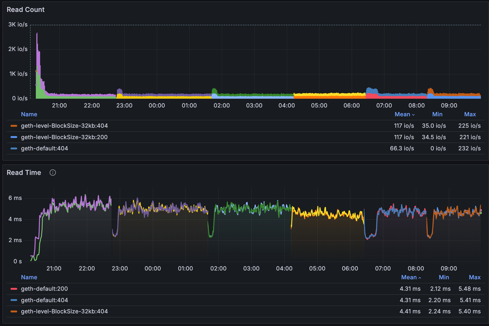

Key findings:

1. Read latency is really bad, mean time is 4.3ms, up to 6ms
2. The read performance is similar, no related to the different pebble configurations

#### 3TB + read-only

Then we test with the read-only mode, with a new `geth-optimized` [test case](https://github.com/jsvisa/goleveldb-bench/blob/5cccbcf5d23aca3a74713ce104691aee540b9292/cmd/pdb-readbench/pdb-readbench.go#L364-L388):

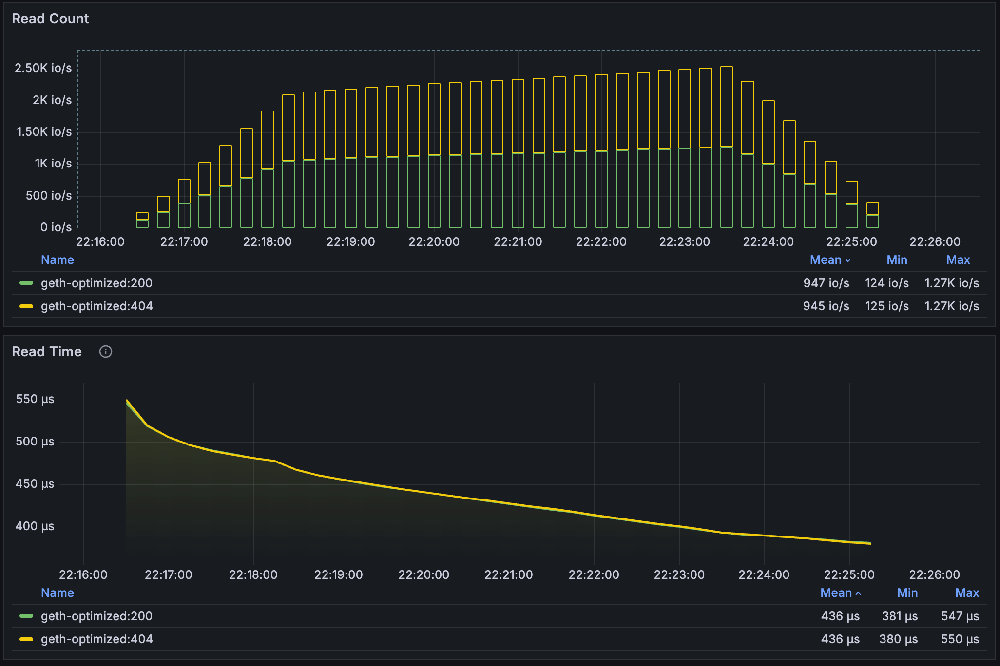

Key findings:

1. Read latency is better than the sidewrite's case
2. The latency of read operations has been gradually reduced. This might be due to the block cache, as that compaction has not occurred

Later we manully compacting the 3TB, the log before and after as below:

```
2025/05/03 07:18:37 Before compaction metrics:
      |                             |       |       |   ingested   |     moved    |    written   |       |    amp
level | tables  size val-bl vtables | score |   in  | tables  size | tables  size | tables  size |  read |   r   w
------+-----------------------------+-------+-------+--------------+--------------+--------------+-------+---------
    0 |   100  228MB     0B       0 |  0.86 |    0B |     0     0B |     0     0B |     0     0B |    0B |   7  0.0
    1 |    18   64MB     0B       0 |  2.75 |    0B |     0     0B |     0     0B |     0     0B |    0B |   1  0.0
    2 |   117  548MB     0B       0 |  1.05 |    0B |     0     0B |     0     0B |     0     0B |    0B |   1  0.0
    3 |   604  4.6GB     0B       0 |  1.00 |    0B |     0     0B |     0     0B |     0     0B |    0B |   1  0.0
    4 |  2.2K   40GB     0B       0 |  1.00 |    0B |     0     0B |     0     0B |     0     0B |    0B |   1  0.0
    5 |  9.2K  338GB     0B       0 |  1.00 |    0B |     0     0B |     0     0B |     0     0B |    0B |   1  0.0
    6 |   35K  2.8TB     0B       0 |     - |    0B |     0     0B |     0     0B |     0     0B |    0B |   1  0.0
total |   47K  3.2TB     0B       0 |     - |    0B |     0     0B |     0     0B |     0     0B |    0B |  13  0.0
-------------------------------------------------------------------------------------------------------------------
WAL: 1 files (0B)  in: 0B  written: 0B (0% overhead)
Flushes: 0
Compactions: 0  estimated debt: 8.2GB  in progress: 9 (0B)
             default: 0  delete: 0  elision: 0  move: 0  read: 0  rewrite: 0  multi-level: 0
MemTables: 1 (256KB)  zombie: 1 (4.0MB)
Zombie tables: 0 (0B)
Backing tables: 0 (0B)
Virtual tables: 0 (0B)
Block cache: 0 entries (0B)  hit rate: 0.0%
Table cache: 0 entries (0B)  hit rate: 0.0%
Secondary cache: 0 entries (0B)  hit rate: 0.0%
Snapshots: 0  earliest seq num: 0
Table iters: 0
Filter utility: 0.0%
Ingestions: 0  as flushable: 0 (0B in 0 tables)

2025/05/03 07:18:37 Compacting the database
2025/05/03 14:12:46 Compaction took 6h54m9.313546491s
2025/05/03 14:12:46 After compaction metrics:
      |                             |       |       |   ingested   |     moved    |    written   |       |    amp   |     multilevel
level | tables  size val-bl vtables | score |   in  | tables  size | tables  size | tables  size |  read |   r   w  |    top   in  read
------+-----------------------------+-------+-------+--------------+--------------+--------------+-------+----------+------------------
    0 |     0     0B     0B       0 |  0.00 |    0B |     0     0B |     0     0B |     0     0B |    0B |   0  0.0 |    0B    0B    0B
    1 |     0     0B     0B       0 |  0.00 | 228MB |     0     0B |     0     0B |    95  331MB | 331MB |   0  1.5 |    0B    0B    0B
    2 |     0     0B     0B       0 |  0.00 | 265MB |     0     0B |     0     0B |   186  925MB | 923MB |   0  3.5 |    0B    0B    0B
    3 |     0     0B     0B       0 |  0.00 | 689MB |     0     0B |     1   958B |   580  4.3GB | 4.3GB |   0  6.3 |  27MB 318MB 2.2GB
    4 |     0     0B     0B       0 |  0.00 | 4.0GB |     0     0B |     0     0B |  2.0K   30GB |  30GB |   0  7.3 | 153MB 1.6GB  13GB
    5 |     0     0B     0B       0 |  0.00 |  33GB |     0     0B |     2  2.1MB |  8.7K  250GB | 251GB |   0  7.5 | 1.4GB  16GB 132GB
    6 |   38K  3.1TB     0B       0 |     - | 382GB |     0     0B |     0     0B |   39K  3.1TB | 3.2TB |   1  8.4 |  12GB 136GB 1.1TB
total |   38K  3.1TB     0B       0 |     - |    0B |     0     0B |     3  2.1MB |   51K  3.4TB | 3.5TB |   1  0.0 |  13GB 154GB 1.2TB
---------------------------------------------------------------------------------------------------------------------------------------
WAL: 1 files (0B)  in: 0B  written: 0B (0% overhead)
Flushes: 0
Compactions: 10703  estimated debt: 0B  in progress: 0 (0B)
             default: 10700  delete: 0  elision: 0  move: 3  read: 0  rewrite: 0  multi-level: 1084
MemTables: 1 (256KB)  zombie: 1 (4.0MB)
Zombie tables: 0 (0B)
Backing tables: 0 (0B)
Virtual tables: 0 (0B)
Block cache: 0 entries (0B)  hit rate: 0.0%
Table cache: 0 entries (0B)  hit rate: 33.9%
Secondary cache: 0 entries (0B)  hit rate: 0.0%
Snapshots: 0  earliest seq num: 0
Table iters: 0
Filter utility: 0.0%
Ingestions: 0  as flushable: 0 (0B in 0 tables)
```

#### 3TB after compaction

Retest without `-sidewrite`:

```bash
pdb-readbench -keysize 65b -valuesize 1kb -keydir /md1/pb-keys/batch-100kb-mt-1gb-cache-04gb -logdir pebble-read-logs -dir /md0/pb-dataset/testdb-batch-100kb-mt-1gb-cache-04gb/ -size 10mb -keyrandom 50 -test geth-FlushSplitBytes-2mb,geth-L0CompactionThreshold-4,geth-L0StopWritesThreshold-1000,geth-MemTableSize-64mb,geth-default,geth-level-BlockSize-32kb,geth-level-BlockSize-32kb-IndexBlockSize-256kb
```

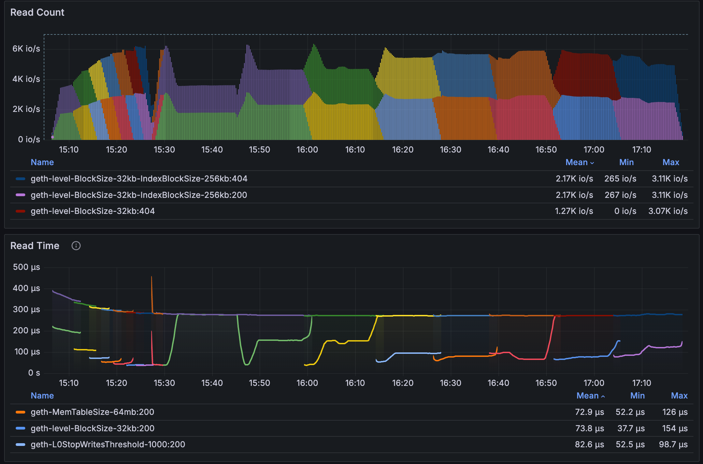

Key findings:

1. The latency of the existing keys are really good, minimum to 50us
2. The manual compaction can improve read performance by 7x
3. The latency of the not-found keys are 8 times worse than the existing keys, and the latency is stable, I think this maybe in the manully compaction, the bloom filter was destroyed?

Retest with `-sidewrite` and a long running period(change `-size=10m` to `-size=100m`) to see the latency of a long running process:

```bash
pdb-readbench -sidewrite -keysize 65b -valuesize 1kb -keydir /md1/pb-keys/batch-100kb-mt-1gb-cache-04gb -logdir pebble-read-logs -dir /md0/pb-dataset/testdb-batch-100kb-mt-1gb-cache-04gb/ -size 100mb -keyrandom 50 -test geth-FlushSplitBytes-2mb,geth-L0CompactionThreshold-4,geth-L0StopWritesThreshold-1000,geth-MemTableSize-64mb,geth-default,geth-level-BlockSize-32kb,geth-level-BlockSize-32kb-IndexBlockSize-256kb
```

Here is the side write bytes chart:

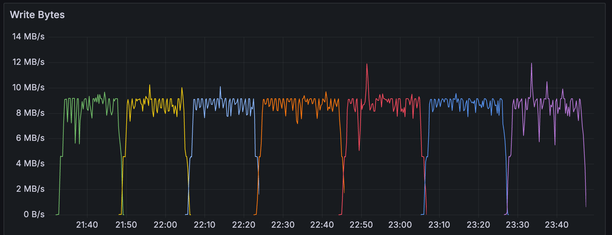

And here is the read count and latency: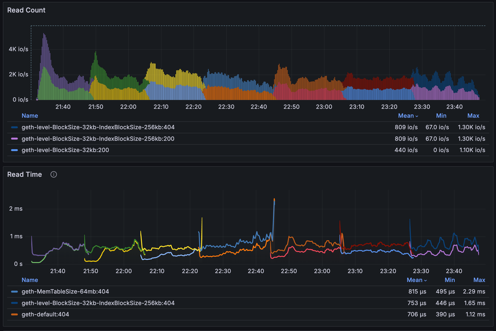

Key findings:

1. The read latency was worse than the readonly case(same as the previous findings)

##### Conclusions

The benchmark results demonstrate that Pebble's performance in Geth's workflow is heavily influenced by configuration settings and workload patterns. While read performance is generally good under stable conditions, it can degrade significantly during compaction operations. The optimal configuration depends on the specific workload, available resources, and performance requirements.

Key takeaways:

1. Read performance is more critical than write performance in Geth's workflow
2. The read latency is stable to ~100us under a stable db
3. The read latency may degrade to as low as 1ms when a large volume of data is written and compaction occurs
4. Compaction management is crucial for maintaining consistent performance
