# Pebble Read Performance Based on Geth's Workflow

In this document, we aim to investigate the performance of Pebble's read operations under the default configuration of Geth.
We will also examine the performance differences across various database sizes, with a primary focus on read-only and read-write operation scenarios.

## Setup and Usage Instructions

### Monitoring Stack Setup

This benchmark uses a monitoring stack consisting of Prometheus for metrics collection, Grafana for visualization, and Node Exporter for system metrics.

2. Start the monitoring services:

```bash
docker compose up -d
```

3. Access the monitoring interfaces:

- Grafana: http://localhost:3000 (default credentials: admin/admin)
- Prometheus: http://localhost:9090

### Benchmark Tools

The benchmark uses two main tools: `pdb-writebench` for write performance testing and `pdb-readbench` for read performance testing.

#### Building the Tools

```bash
# Build both benchmark tools
go install ./cmd/pdb-writebench
go install ./cmd/pdb-readbench
```

#### pdb-writebench

A tool for benchmarking Pebble DB write performance. It can generate datasets of various sizes and test different write configurations.

Key features:

- Supports different database sizes (e.g., 100GB, 500GB, 3TB)
- Configurable key and value sizes
- Multiple write strategies (batch, no-batch, concurrent)
- Prometheus metrics integration
- Simulates Geth's workflow with `-test geth-default`

Example usage:

```bash
pdb-writebench -keysize 65b -valuesize 16b -dir /path/to/db -test geth-default -size 100gb -keydir /path/to/keys -logdir logs
```

Key arguments:

1. `-keysize 65b` Key-Value key size as 65 bytes
2. `-valuesize 16b` Key-Value value size as 16bytes
3. `-dir /path/to/db` Use this path to store the pebble db
4. `-test geth-default` Use [geth's configuration](https://github.com/ethereum/go-ethereum/blob/master/ethdb/pebble/pebble.go#L190) for writing, here we use `async` write to speed up the writing process
5. `-size 100gb` Write 100GB of key-value pairs into the database
6. `-keydir /path/to/keys` Use this path to store the keys, to minimize the impact of the disk io bandwidth, it is recommended to set this directory to a different disk from that of Pebble used(`-dir`)
7. `-logdir pb-testlogs` Used to store the progress logs

#### pdb-readbench

A tool for benchmarking Pebble DB read performance in both read-only and read-write modes.

Key features:

- Read-only and read-write testing modes
- Configurable key distribution
- Side-write thread for simulating concurrent writes
- Prometheus metrics integration
- Simulates Geth's workflow with `-test geth-default`

Example usage:

```bash
# Read-only mode
pdb-readbench -keysize 65b -keydir /path/to/keys -logdir logs -dir /path/to/db -size 100mb -keyrandom 50 -test geth-default

# Read-write mode with side writes
pdb-readbench -keysize 65b -keydir /path/to/keys -logdir logs -dir /path/to/db -size 100mb -keyrandom 50 -test geth-default -sidewrite -valuesize 16b
```

Key arguments:

1. `-keysize 65b` Key size for read operations, should match the key size used during write
2. `-keydir /path/to/keys` Directory containing the key files generated by pdb-writebench
3. `-logdir logs` Directory to store benchmark logs and metrics
4. `-dir /path/to/db` Path to the Pebble database to test
5. `-size 100mb` Amount of data to read during the benchmark
6. `-keyrandom 50` Percentage of random keys to use (0-100), 50 means 50% existing keys and 50% non-existent keys
7. `-test geth-default` Use Geth's default configuration for testing
8. `-sidewrite` (Optional) Enable side-write thread to simulate concurrent writes
9. `-valuesize 16b` (Optional) Size of values to write in side-write mode
10. `-metrics-addr :2112` (Optional) Address to serve Prometheus metrics on, default on `http://0.0.0.0:2112`

The side-write thread in read-write mode:

- Writes `-valuesize` of data at 100 requests per second
- Performs a burst write of 500MB every minute
- Uses sync writes (same as Geth's workflow)

## Geth's Workflow

We use `geth import` to simulate the block insertion process and analyze Pebble's performance during this operation.

**Note**: Currently, Geth doesn't have built-in database performance metrics. We've added metrics to Pebble and use [jsvisa/go-ethereum at state-reader-metric](https://github.com/jsvisa/go-ethereum/tree/state-reader-metric) to monitor performance.

The `geth import` command is configured as follows:

```bash
./bin/geth import \
    --db.engine=pebble \
    --datadir=data-base-xm \
    --cache=80960 \
    --cache.database=20 \
    --cache.snapshot=20 \
    --cache.gc=1 \
    --cache.trie=50 \
    --metrics --metrics.addr=0.0.0.0 --metrics.port=7540 \
    --state.scheme=path \
    --history.transactions=235000 \
    --history.state=90000 \
    --nocompaction \
    /hdd/geth-export-full/geth.blocks.0m-1m.gz \
    /hdd/geth-export-full/geth.blocks.1m-2m.gz \
    ...
    >> logs/import.log 2>&1
```

The host has 128GB of memory, with 80GB allocated as follows:

- Pebble DB cache: 16GB (20% of 80GB)
- Snapshot fastcache: 16GB (20% of 80GB)
- Trie pathdb fastcache: 40GB (50% of 80GB)

We use the [grafana/geth-pebble.json](./grafana/geth-pebble.json) dashboard to monitor performance metrics. Here are the key findings from the Geth import process:

### Blockchain Metrics

> Chain Insertion Time

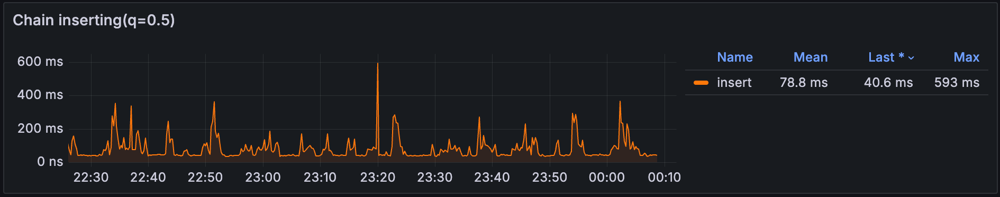

The mean chain insertion time is 78.8ms, with a maximum of 593ms.

> Phase Timing Breakdown

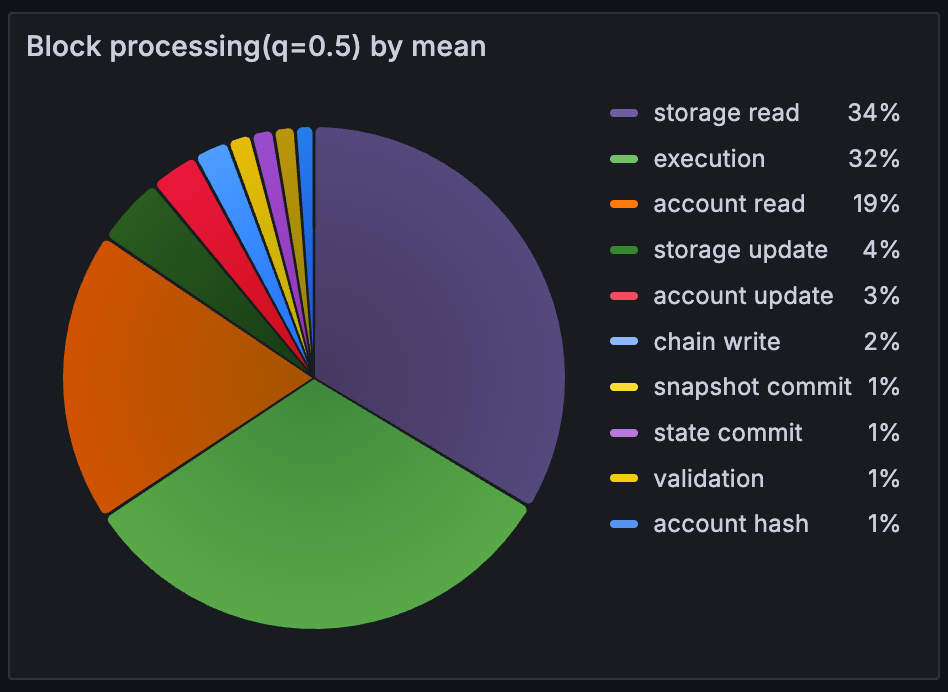

| Phase           | Time (ms) | Percentage |
| --------------- | --------- | ---------- |
| storage read    | 22.0      | 34%        |
| execution       | 21.0      | 32%        |
| account read    | 12.3      | 19%        |
| storage update  | 2.90      | 4%         |
| account update  | 2.01      | 3%         |
| chain write     | 1.45      | 2%         |
| snapshot commit | 0.96      | 1%         |
| state commit    | 0.91      | 1%         |
| validation      | 0.86      | 1%         |
| account hash    | 0.74      | 1%         |

The analysis shows that 53% of the time (34% + 19%) is spent on storage and account reads, making these areas prime candidates for performance optimization.

For storage reads, we observe:

- Mean read time: 22ms
- Minimum time: 5.32ms
- Maximum time: 216ms

The significant variation in read times indicates potential optimization opportunities.

### State Metrics

The state reader in Geth uses a CachingDB that combines readers from multiple sources:

1. Snapshot flat reader
2. Trie hashdb/pathdb reader

The implementation can be found in [core/state/database.go](https://github.com/ethereum/go-ethereum/blob/2c52922ab4567a8cccd63ced2e88e892123072c4/core/state/database.go#L175-L209).

And the snapshot consists of three layers:

1. Diff layer (the most recent 128 block states)
2. Disk layer fast cache (LRU cache)
3. On-disk rawdb (Pebble DB)

Read distribution charts:

> Account Read Distribution

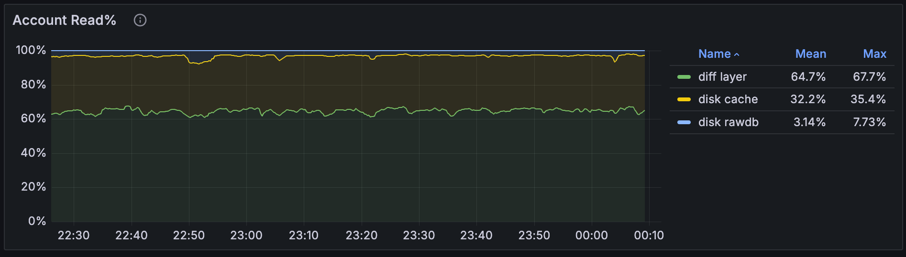

> Storage Read Distribution

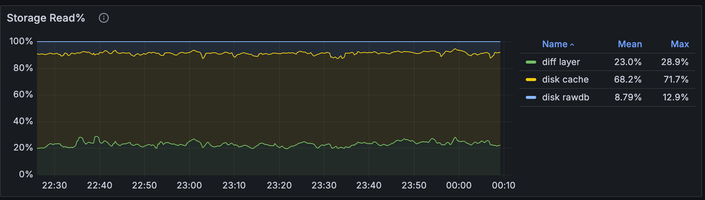

**Only 3.14% of account reads and 8.79% of storage reads hit the on-disk rawdb, with most data being served from the diff layer and disk layer fast cache.**

### Ethdb (Pebble) Metrics

The [ethdb/pebble](https://github.com/ethereum/go-ethereum/tree/master/ethdb/pebble) implementation provides detailed metrics for monitoring Pebble's workflow and performance.

Read and write request distribution:

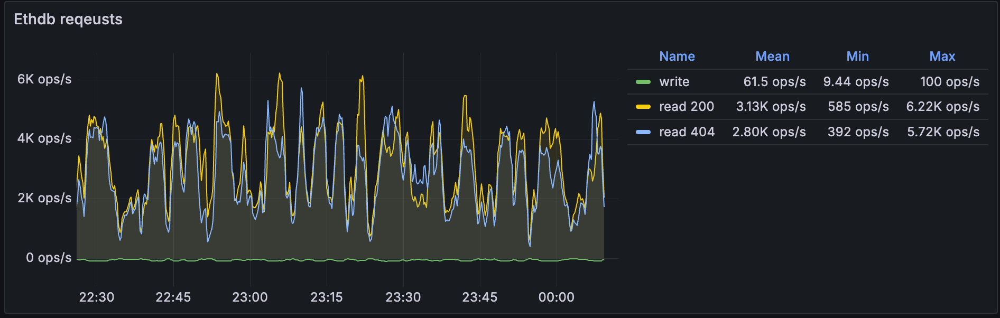

| Metric name | Mean(ops) | Min(ops) | Max(ops) |
| ----------- | --------- | -------- | -------- |
| write       | 61.5      | 9.44     | 100      |
| read 200    | 3130      | 585      | 6220     |
| read 404    | 2800      | 392      | 5720     |

Note:

- `read 200` indicates the key was retrieved in the db,
- `read 404` indicates the key was not found.

Key observations:

1. Read operations (both 200 and 404) are significantly more frequent than writes (approximately 3100x times)
2. The frequency of successful and failed reads are roughly equal to 1:1

#### Ethdb latency breakdown

Here comes the latency of each operation:

> Write Latency

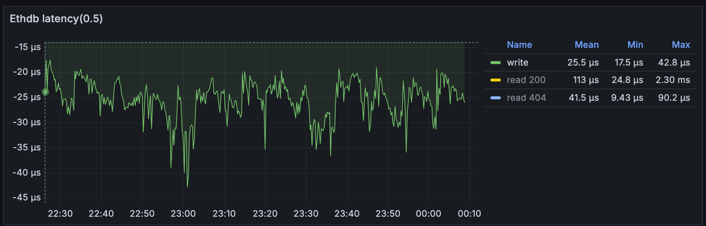

> Read 200 Latency

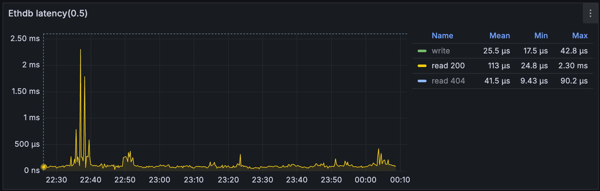

> Read 404 Latency

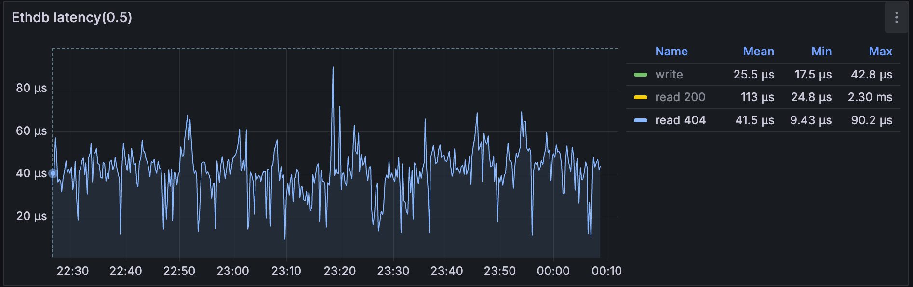

| Metric name | Mean(μs) | Min(μs) | Max(μs) |
| ----------- | -------- | ------- | ------- |
| write       | 25.5     | 17.5    | 42.8    |
| read 200    | 113      | 24.8    | 2300    |
| read 404    | 41.5     | 9.43    | 90.2    |

Key findings:

1. Write latency is consistently low (25.5μs) due to `sync: false` write options
2. Read latency is significantly higher than the write latency
3. Read 200 latency shows high variability, indicating potential optimization opportunities
4. Read 404 latency remains stable

In the meanwhile, we found that the read 200 latency seems has some relationship with the pebble compaction count:

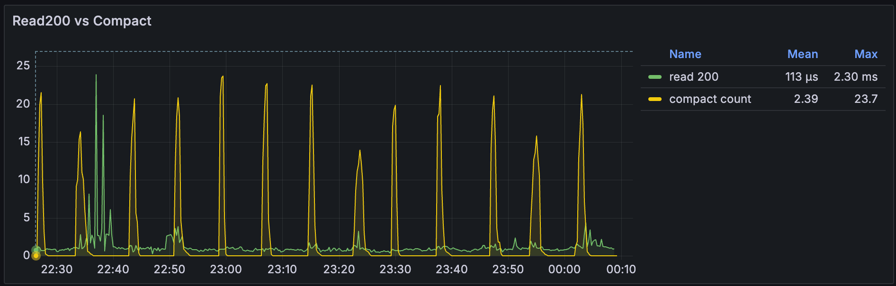

When compaction occurs, a large number of SST files need to be read and written to the next level, which consumes a lot of disk I/O bandwidth, and results in insufficient I/O for reading.

In our subsequent optimization process, we can consider how to reduce compaction, eg:

1. How to decrease the number of SST files that are required for each compaction?
2. Whether it is possible to perform compaction more quickly and smoothly?
3. Whether it is feasible to limit the bandwidth for read and compaction operations, eg: separate them into different read and write queues.

#### Ethdb write bandwidth

Here is the write bandwidth metrics, which is calculated by the bytes flushed - bytes compacted. This metric is roughly equivalent to the amount of data written to the raw database.

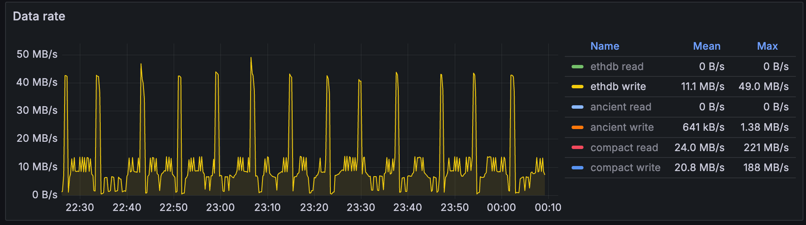

Key findings:

- Mean write bandwidth: 11MB/s
- Peak write bandwidth: 49MB/s
- The data writing is uneven, on avarage, there will be a peak period of writing every 10minuts or so

## Pebble Read Benchmark

Our initial read benchmark used a stable database without writes, which doesn't accurately reflect Geth's workload. We need to simulate a more realistic scenario:

1. Initialize the database with a substantial size (e.g., 100GB) using key-value sizes similar to Geth's
2. Benchmark read performance with 50% existing keys and 50% non-existent keys
3. Run a sidecar write thread to simulate database mutations
4. Measure read performance under these conditions
5. Increase the db size to 500GB, 2TB and continue the actions before.

### 0. Database Initialization

We can use `geth db inspect` to get a glimpse of the db distribution within the geth chaindb. This analysis is based on a running ethereum mainnet at block 22421889 [@block 2025-05-06](http://etherscan.io/block/22421889). The inspection results can be found at https://hackmd.io/@jsvisa/HJ2shlweeg, we pay attention to the snapshot parts:

| Category         | Total Size | Count      | Avg Value Size |
| ---------------- | ---------- | ---------- | -------------- |
| Account snapshot | 13.17GiB   | 287454824  | 16B            |
| Storage snapshot | 92.56GiB   | 1282940697 | 12B            |

- Account snapshot key length is 33: `13.17*1024*1024*1024/287454824-33 = 16.194 `
- Storage snapshot key length is 65: `92.56*1024*1024*1024/1282940697-65 = 12.467 `

So we first run the `pdb-writebench` as below:

```bash
pdb-writebench -keysize 65b -valuesize 16b -dir /md0/pb-dataset -test geth-default -size 100gb -keydir /md1/pb-keys -logdir pb-testlogs
```

### 1. 100GB test

After the write process, which lasted approximately 2hours, the database accumulated around 116GB, so the Space Amplifier is 1.16;

#### read-only

Now let's begin the read-only mode test on this db:

```bash
pdb-readbench -keysize 65b -keydir /md2/pb-keys/geth-default -logdir pebble-read-logs -dir /md0/pb2/testdb-geth-default -size 100mb -keyrandom 50 -test geth-default
```

Now you can navigate to Grafana dashboard to see the benchmark metrics, eg if you're running the benchmark in the local host, visit  `http://127.0.0.1:3000`:

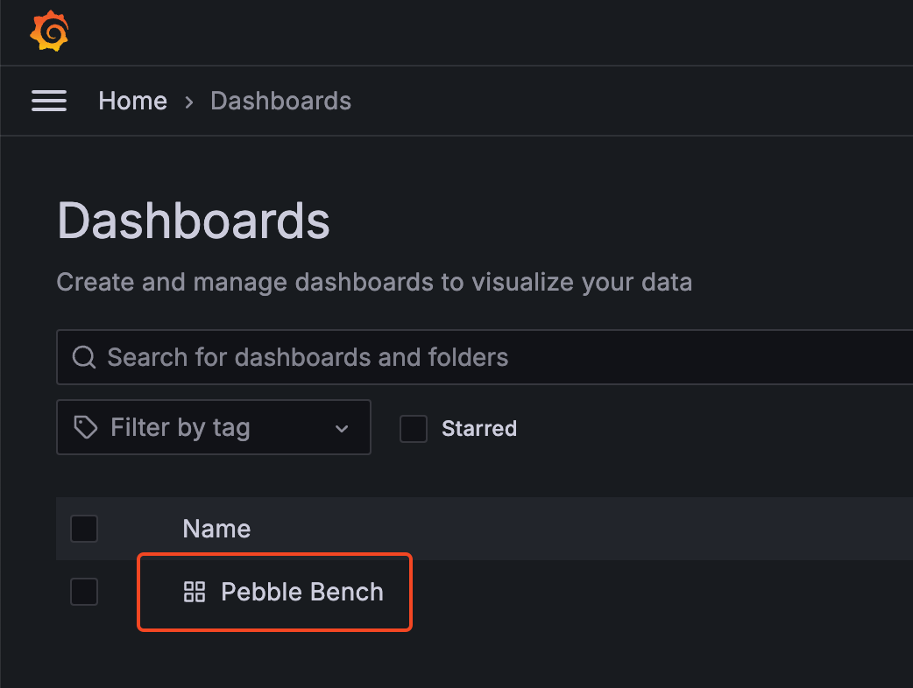

We can only focus on the Read related metrics, such as QPS and latency.

> Read QPS

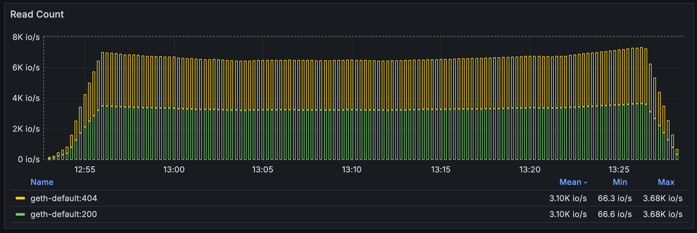

> Read Latency

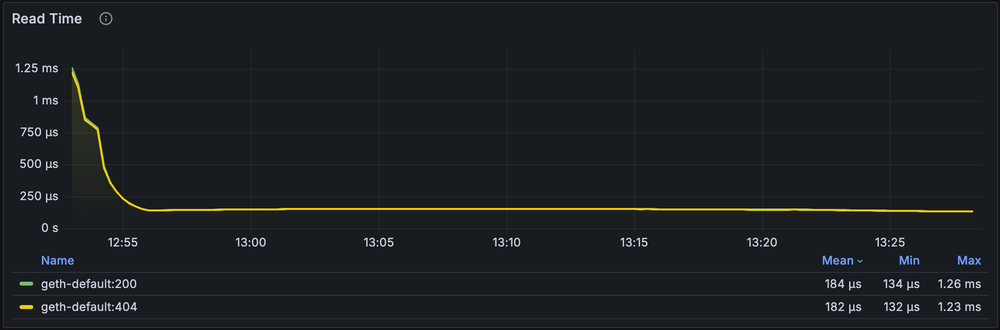

> Compaction count
>
> 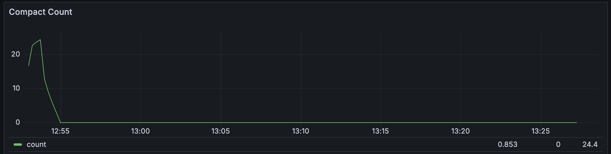

Key findings:

1. Initially,the read latency was poor.This may have been due to the fact that the database had just been initialized,and the read operations triggered compaction.As a result,the majority of the I/O bandwidth was consumed by the compaction process.
2. After the initial setup,the read performance became more stable.The variance in read latency was minimal,with an average read time of **130μs** consistency was observed, regardless of whether the key being queried existed or was not found in the database.

#### read-write

Then test with the read-write mode

```bash
pdb-readbench -keysize 65b -keydir /md2/pb-keys/geth-default -logdir pebble-read-logs -dir /md0/pb2/testdb-geth-default -size 100mb -keyrandom 50 -test geth-default -sidewrite -valuesize 16b
```

In this test case,we append the `-sidewrite -valuesize 16b` parameters to the command line.

**After the benchmark, the db size reached to 147GB**

> Read QPS
>
> 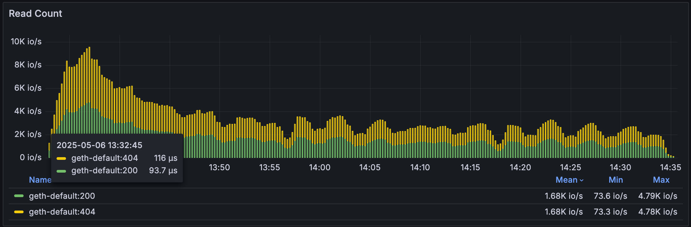

> Read latency

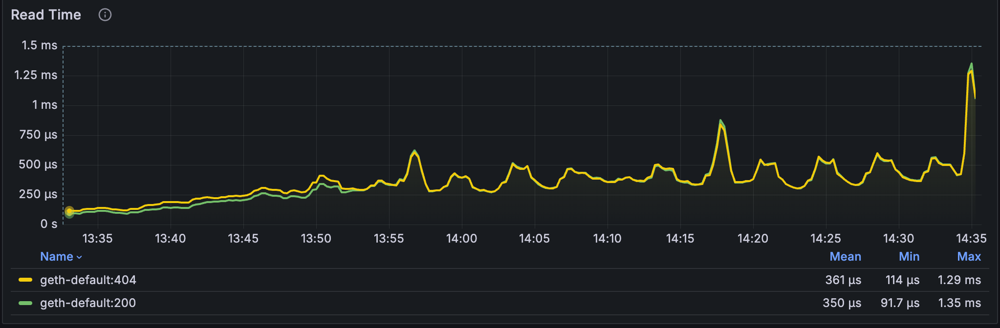

Key findings:

1. Compared to the read-only mode, in read-write, the read latency is worse, the mean latency degraded from **130μs** to **360μs**
1. In this read-write mode, the read performance is unstable. As the test progresses, the latency gradually degraded from **100μs to 500μs**

### 2. 500GB test

Let's proceed with writing an additional 400 GB into the database, let the database reaches 500GB. Before we start the write process, the current database size is:

```bash
du -sh /md2/pb2/testdb-geth-default
147GB
```

The write process is the same to 100GB, change the `-size 100gb` to `-size 400gb`:

```bash
pdb-writebench -keysize 65b -valuesize 16b -dir /md0/pb2 -test geth-default -size 400gb -keydir /md2/pb-keys -logdir pb-testlogs
```

After the write process, which lasted approximately **16hours**, the database accumulated around 483GB, so the Space Amplifier is (483-147)/400 =0.84.

Compared with the 100GB which takes 2 hours to process, now 400GB requires 16 hours. This indicates that the performance difference is twice as much as that of 100GB.

#### read-only

Use the same command as 100GB's:

```bash
pdb-readbench -keysize 65b -keydir /md2/pb-keys/geth-default -logdir pebble-read-logs -dir /md0/pb2/testdb-geth-default -size 100mb -keyrandom 50 -test geth-default
```

> Read QPS
>
> 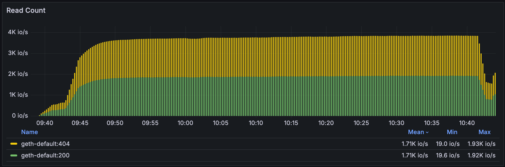

> Read Latency
>
> 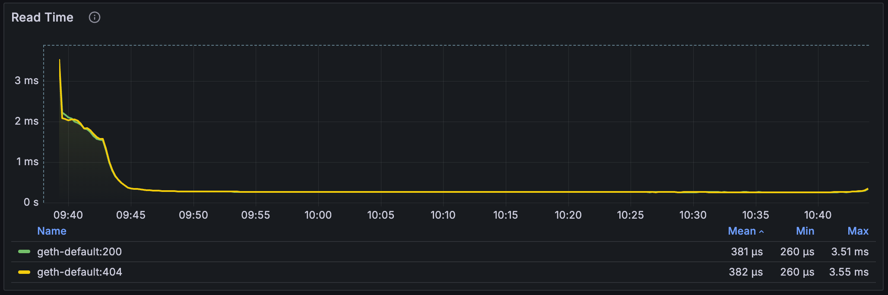

Key findings:

1. The variation of performance is similar to that of 100GB. Both have a relatively high latency during the initial stage, and then gradually stabilize.

#### read-write

Then test with the read-write mode

```bash
pdb-readbench -keysize 65b -keydir /md2/pb-keys/geth-default -logdir pebble-read-logs -dir /md0/pb2/testdb-geth-default -size 100mb -keyrandom 50 -test geth-default -sidewrite -valuesize 16b
```

In this test case,we append the `-sidewrite -valuesize 16b` parameters to the command line.

> Read QPS
>
> 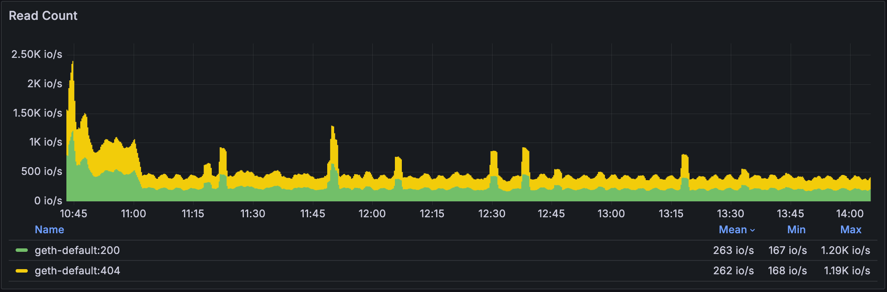

> Read latency
>
> 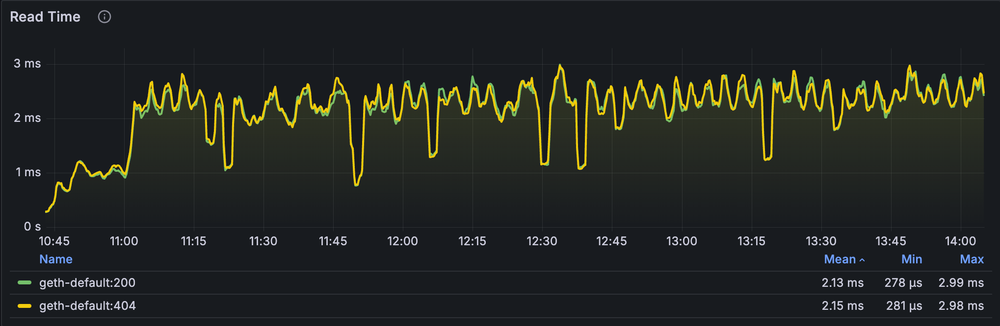

Key findings:

1. The read perfromance is really bad, the latency reached to 3ms!

In order to ensure the smooth progress of the experiment, we use [cmd/pebble-compact](./cmd/pebble-compact/) to do manually performed full compaction on the database. The compaction of 500GB costs 90minutes.

This slow speed might be due to the performance of the disk. From the monitoring, during the compaction process, the read/write bandwidth was only 113MB/s.

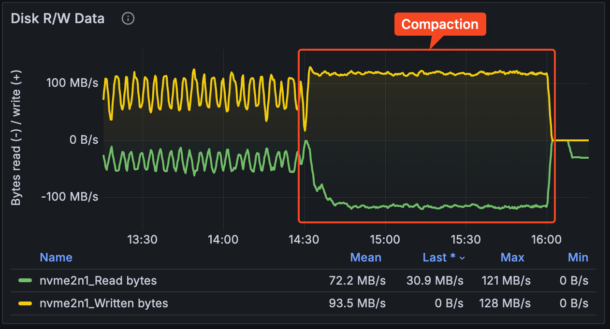

After the compaction, let's retest the read-only and read-write performance, put the test results as below

#### read-only after compaction

> Read QPS

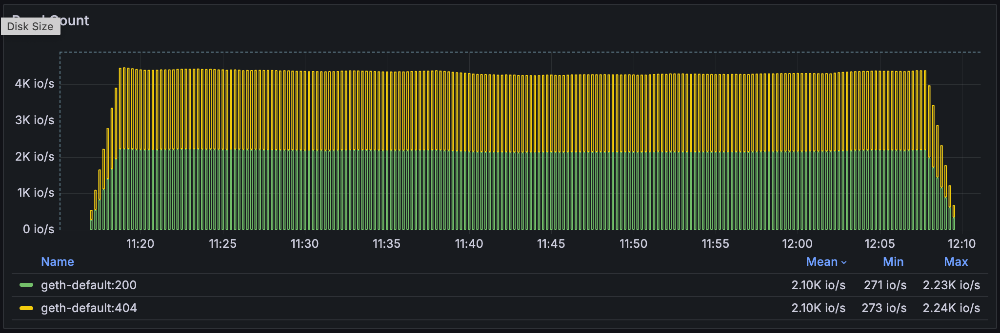

> Read Latency

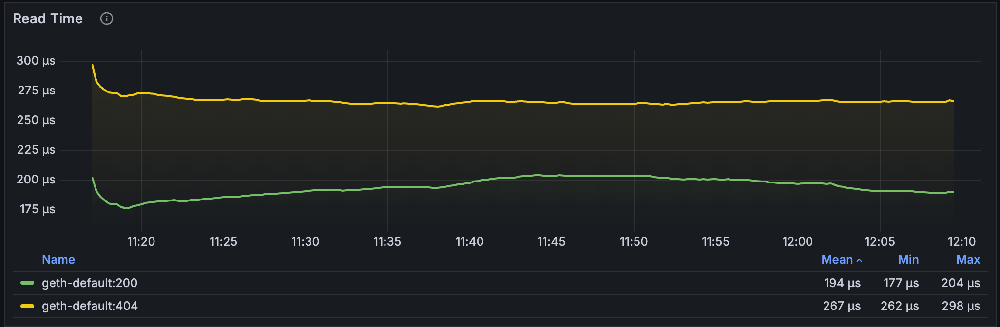

Key findings:

1. After the compaction, the read latency is way better than before the compaction, it reached to ~200μs again
2. After the compaction, the read 404's latency is 1.37x times of read 202's

#### read-write after compaction

> Read QPS

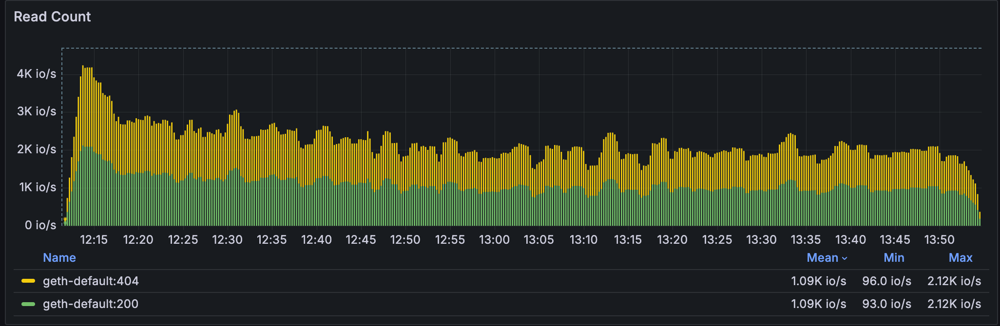

> Read Latency

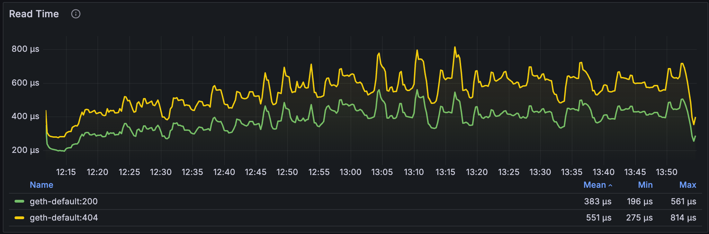

Key findings:

1. Similar to the read-only case, the read 404's latency is 1.43x times of read 202's

### 3. 3TB test

#### read-only

Use the same command as 100GB's:

```bash
pdb-readbench -keysize 65b -keydir /md2/pb-keys/geth-default -logdir pebble-read-logs -dir /md0/pb2/testdb-geth-default -size 100mb -keyrandom 50 -test geth-default
```

> Read QPS
>
> 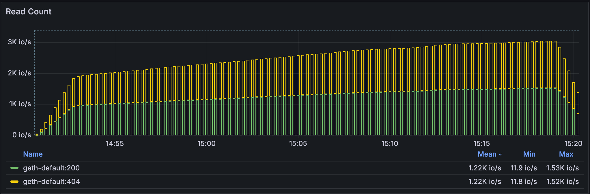

> Read Latency
>
> 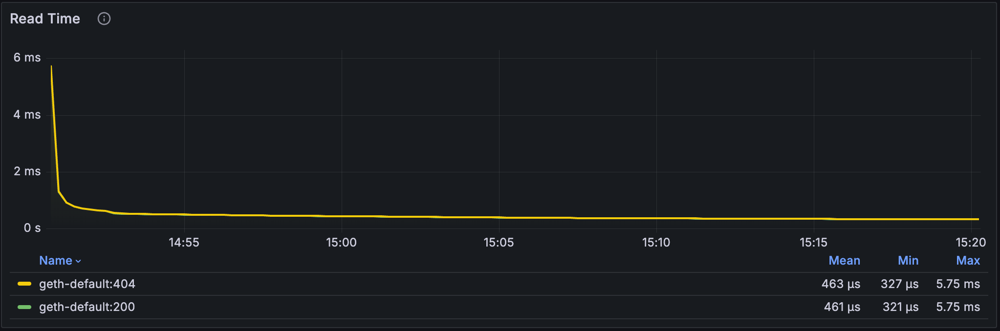

> Compaction count
>
> 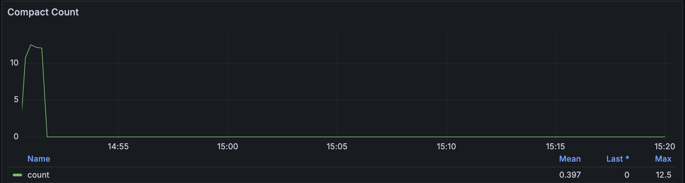

Key findings:

1. After the initial setup, the mean read latency is 460μs, which is 3.5 times higher than that of the 100 GB database size scenario

#### read-write

Then test with the read-write mode:

```bash
pdb-readbench -keysize 65b -keydir /md2/pb-keys/geth-default -logdir pebble-read-logs -dir /md0/pb2/testdb-geth-default -size 100mb -keyrandom 50 -test geth-default -sidewrite -valuesize 16b
```

The Write speed as before, stable at 9MB/s

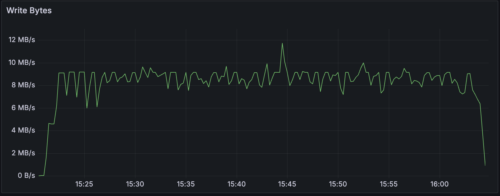

**After the write process, the db reached from 3.17TB to 3.20TB**

> Read QPS
>
> 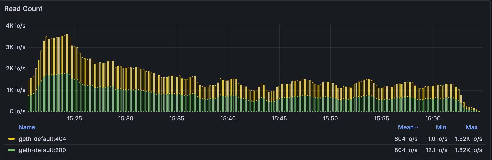

> Read latency
>
> 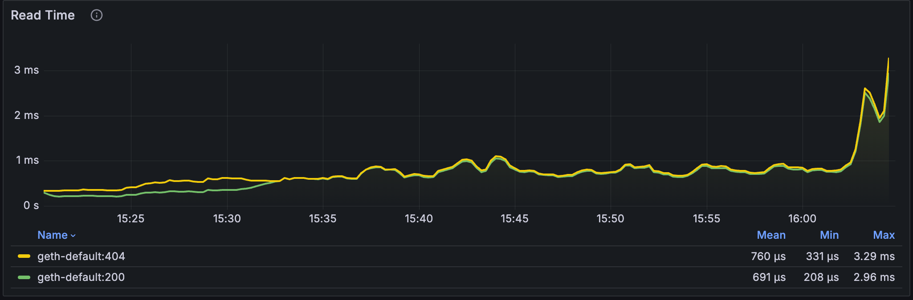
>
> Compaction
>
> 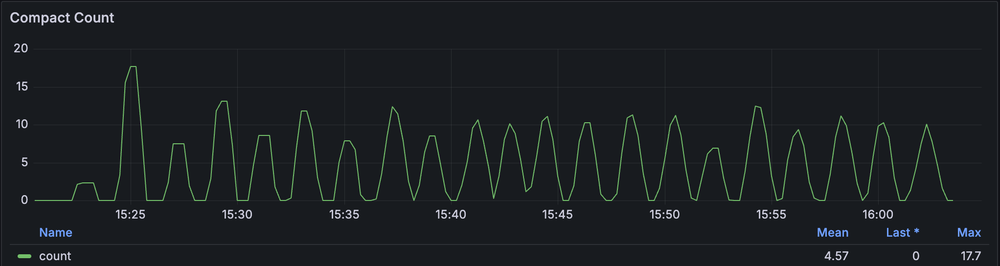

Key findings:

1. The read latency is 760μs, which is 2 times higher than 100GB case

##### Conclusions

> Read Latency On read-only workload

| DB Size       | Mean(**μs**) | Min(**μs**) | Max(**μs**) |
| :------------ | ------------ | ----------- | ----------- |
| 100GB(200) BC | 149          | 133         | 155         |
| 100GB(404) AC | 148          | 134         | 154         |
| 500GB(200) BC | 269          | 260         | 376         |
| 500GB(404) BC | 269          | 260         | 376         |
| 500GB(200) AC | 194          | 177         | 204         |
| 500GB(404) AC | 267          | 262         | 298         |
| 3TB(200) AC   | 392          | 327         | 524         |
| 3TB(404) AC   | 393          | 327         | 526         |

> Read Latency On read-write workload

| DB Size       | Mean(**μs**) | Min(**μs**) | Max(**μs**) |
| ------------- | ------------ | ----------- | ----------- |
| 100GB(200) BC | 335          | 91.7        | 875         |
| 100GB(404) BC | 347          | 114         | 838         |
| 500GB(200) BC | **2130**     | 278         | **2910**    |
| 500GB(404) BC | **2150**     | 281         | **2980**    |
| 500GB(200) AC | 383          | 196         | 561         |
| 500GB(404) AC | 551          | 275         | 814         |
| 3TB(200) AC   | 624          | 208         | **1060**    |
| 3TB(404) AC   | 691          | 332         | **1100**    |

Hints:

1. AC = after compaction; BC = before compaction
1. For the `mean` value, we removed the latency period at the beginning of the benchmark and instead used the time at the middle stage.

Key findings:

1. **Database Size Impact**

   - Read performance degrades as database size increases
   - 100GB database shows stable performance (~130μs mean latency)
   - 500GB database shows moderate degradation (~200μs mean latency)
   - 3TB database shows significant degradation (~400μs mean latency)

2. **Read-Write vs Read-Only Performance**

   - Read-write workloads show significantly higher latency than read-only workloads
   - 100GB: 130μs (read-only) vs 360μs (read-write)
   - 500GB: 200μs (read-only) vs 550μs (read-write)
   - 3TB: 400μs (read-only) vs 700μs (read-write)

3. **Compaction Impact**

   - Manual compaction significantly improves read performance
   - 500GB database:
     - Before compaction: ~3ms read latency
     - After compaction: ~200μs read latency (15x improvement)
   - Compaction process:
     - Takes ~90 minutes for 500GB database
     - Limited by disk I/O bandwidth (113MB/s)
     - Suggests potential for optimization in compaction strategy

4. **Key Distribution**

   - Read latency for non-existent keys (404) is consistently higher than existing keys (200)
   - This pattern is more pronounced in read-write workloads
   - Possible reasons:
     1. Bloom filter false positives: Even when using bloom filters, some non-existent keys may trigger unnecessary SSTable reads
     2. Search path: For existing keys, the search can stop as soon as the key is found, while non-existent keys require checking all possible locations
     3. Cache behavior: Existing keys are more likely to be cached due to temporal locality, while non-existent keys always require a full search
   - 500GB database examples:
     - Existing keys: 194μs mean latency
     - Non-existent keys: 267μs mean latency (1.37x higher)
   - Pattern consistent across different database sizes

5. **Performance Stability**
   - Read-only workloads show more stable performance
   - Read-write workloads show gradual degradation over time, side-write thread (100 req/s + 500MB burst/min) significantly impacts read performance
   - Initial performance is poor due to compaction activity
   - Performance stabilizes after initial setup period
