# Pebble read/write benchmarks

## hardware

CPU: AMD Ryzen 7 5700G with Radeon Graphics

Memory: 64GB

Disk: Samsung SSD 990 EVO Plus 4TB

### Disk benchmark results

## Write benchmarks

[pdb-writebench](./cmd/pdb-writebench) is a tool to benchmark the write performance of Pebble, it can generate a dataset with a specified size and run the write benchmarks with different configurations, based on [ldb-writebench](./cmd/ldb-writebench),
the usage is similar to `ldb-writebench`, while integrating with Prometheus metrics for enhanced monitoring and analysis.

We will utilize the pebble write benchmarks to evaluate the optimal write configuration using a small dataset (e.g., 5GB).

After the benchmark, we generate the write benchmark results with the following command:

```bash
ldb-benchstat datasets/pebble-write-test/*.json
```

And use `ldb-benchplot` to generate a plot of the write or read benchmarks.

Write benchmarks results as below:

> The `concurrent` and `nobatch` testcases are too slow, ignore them in the later benchmarks

| Benchmark                             | Time          | Mean MB/s          |
| ------------------------------------- | ------------- | ------------------ |
| concurrent                            | 20516.2521s   | 0.173 (+- 0.027)   |
| batch-1mb                             | 1227.5405s    | 4.171 (+- 3.888)   |
| batch-100kb                           | 811.8186s     | 6.307 (+- 5.541)   |
| batch-100kb-nosync                    | 709.8882s     | 7.212 (+- 20.037)  |
| nobatch-nosync                        | 677.9506s     | 7.552 (+- 15.625)  |
| batch-5mb                             | 474.8282s     | 10.783 (+- 11.616) |
| batch-100kb-wb-512mb-cache-1gb        | 389.9965s     | 13.128 (+- 4.603)  |
| batch-100kb-wb-4gb-cache-32gb-nosync  | 213.8393s     | 23.943 (+- 9.150)  |
| batch-100kb-wb-4gb-cache-16gb-nosync  | 204.3798s     | 25.051 (+- 9.517)  |
| batch-100kb-wb-1gb-cache-1gb-nosync   | 195.7156s     | 26.160 (+- 12.967) |
| batch-100kb-wb-512mb-cache-4gb-nosync | 180.1895s     | 28.414 (+- 15.110) |
| batch-100kb-wb-512mb-cache-1gb-nosync | **173.5529s** | 29.501 (+- 15.531) |

General Observations:

- Concurrent writes without batching are the slowest in write benchmarks. If we need to write data quickly, we should opt for batching rather than relying on multiple goroutines.
- Performance Improvement with Caching and No Sync, the benchmarks demonstrate a significant performance improvement when using caching and disabling sync operations.
  This combination is highly effective in enhancing overall performance.
- The benchmarks indicate that a larger cache size is not always better. Specifically, a 1GB cache outperforms caches of 4GB or higher. The exact reason for this phenomenon is still unclear and requires further investigation.

As a result, the optimal write configuration appears to be `batch-100kb-wb-512mb-cache-1gb-nosync`. We plan to test this configuration with a larger dataset to verify whether the results remain consistent.

### write 10gb with different memeory table size

Testing with 10GB data and 1GB cache, with different memory table size:

```bash
pdb-writebench -size 10gb -logdir testdb-pebble/write -dir /md0/pebble-write-test-10gb -test \
    batch-100kb-mt-004mb-cache-1gb, \
    batch-100kb-mt-008mb-cache-1gb, \
    batch-100kb-mt-016mb-cache-1gb, \
    batch-100kb-mt-064mb-cache-1gb, \
    batch-100kb-mt-256mb-cache-1gb, \
    batch-100kb-mt-512mb-cache-1gb \
-deletedb
```

The results are as [follows](./datasets/pebble-write-10gb):

| Benchmark | Time          | Mean MB/s          |
| --------- | ------------- | ------------------ |
| 004mb-1gb | 900.6142s     | 11.369 (+- 12.098) |
| 008mb-1gb | 800.9128s     | 12.785 (+- 8.399)  |
| 016mb-1gb | 711.1493s     | 14.399 (+- 7.751)  |
| 064mb-1gb | 617.7583s     | 16.575 (+- 6.991)  |
| 256mb-1gb | **609.0662s** | 16.812 (+- 7.030)  |
| 512mb-1gb | 610.2748s     | 16.779 (+- 6.865)  |

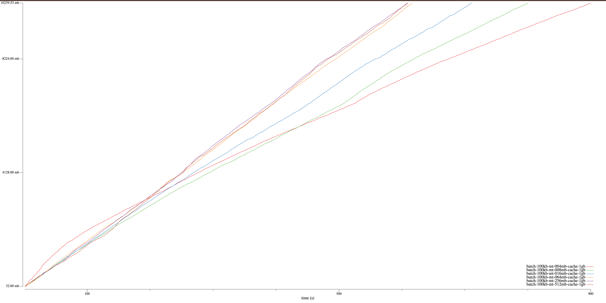

General Observations:

1. The write performance improves as the memory table size increases.
2. When the cache size is 1GB, the write performance remains stable if the memory table size exceeds   `cache/16` or 64MB.

We then tested with 10GB of data and a 1GB, 4GB cache, using memory table sizes of 64MB, 256MB, and 512MB, to determine whether the memory table size should be adjusted in relation to the cache size, results as below:

| Benchmark | Time          | Mean MB/s         |
| --------- | ------------- | ----------------- |
| 064mb-1gb | 617.7583s     | 16.575 (+- 6.991) |
| 256mb-1gb | 609.0662s     | 16.812 (+- 7.030) |
| 512mb-1gb | 610.2748s     | 16.779 (+- 6.865) |
| 1gb-1gb   | 550.5742s     | 18.598 (+- 6.892) |
| 1gb-4gb   | **399.2230s** | 25.649 (+- 8.416) |

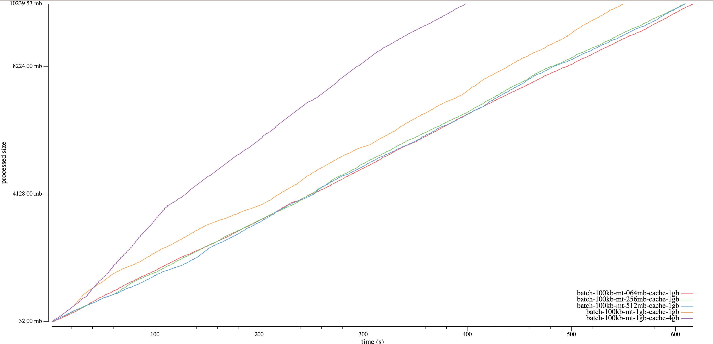

General Observations:

1. 1GB memory table size is better than 64MB.
2. Larger cache size will increase the write performance.

We then tested with large cache size of 8g, 16g, 32g:

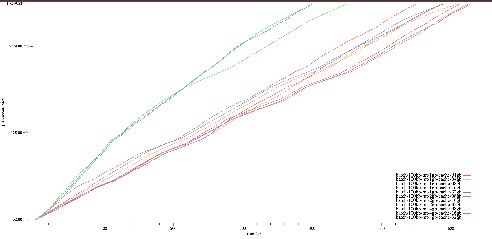

| Benchmark | Time          | Mean MB/s         |
| --------- | ------------- | ----------------- |
| 1gb-01gb  | 550.5742s     | 18.598 (+- 6.892) |
| 1gb-04gb  | **399.2230s** | 25.649 (+- 8.416) |
| 1gb-08gb  | **400.9613s** | 25.537 (+- 8.615) |
| 1gb-16gb  | 585.3147s     | 17.494 (+- 5.653) |
| 1gb-32gb  | 588.2271s     | 17.407 (+- 6.088) |
| 2gb-08gb  | 613.2042s     | 16.698 (+- 4.482) |
| 2gb-16gb  | 625.9508s     | 16.358 (+- 4.745) |
| 2gb-32gb  | 629.0496s     | 16.278 (+- 4.739) |
| 4gb-08gb  | 450.8799s     | 22.710 (+- 8.495) |
| 4gb-16gb  | 591.0455s     | 17.324 (+- 3.462) |
| 4gb-32gb  | 609.8514s     | 16.790 (+- 3.942) |

General Observations:

1. Cache size is not the bigger the better, 4GB and 8GB is a proper good option


To further validate our findings and explore system behavior under more demanding conditions, we conducted additional tests using a significantly larger dataset, specifically 100GB in size. This larger-scale test aimed to assess the scalability and long-term performance of our configurations, providing deeper insights into how the system handles extensive data processing tasks.

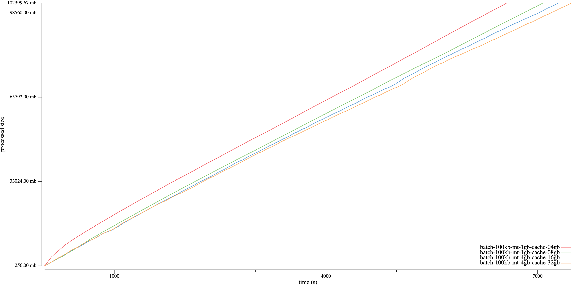

| Benchmark | Time           | Mean MB/s         |
| --------- | -------------- | ----------------- |
| 1gb-04gb  | **6559.6107s** | 15.611 (+- 6.965) |
| 1gb-08gb  | 7074.2569s     | 14.475 (+- 5.960) |
| 4gb-16gb  | 7292.5680s     | 14.042 (+- 5.088) |
| 4gb-32gb  | 7479.5316s     | 13.691 (+- 5.038) |

General Observations:

1. The result is similar to the 10GB dataset, the cache size is not the bigger the better, 4GB and 8GB is a proper good option.
1. The write performance for the 100GB dataset is 1.644 times slower than that of the 10GB dataset.


Besides of the memory table size and cache size, let's test with other write related options:

1. MemTableStopWritesThreshold: stop write if sum(memtable size) > MemTableStopWritesThreshold \* MemTableSize, default is 2
2. MaxConcurrentCompactions: default is 1
3. BytesPerSync: sync sstables periodically in order to smooth out writes to disk, default 512KB
4. WALBytesPerSync: sets the number of bytes to write to a WAL before calling Sync on it in the background, default is 0, no background sync
5. MaxOpenFiles: default is 1000
6. LBaseMaxBytes: the maximum number of bytes for LBase. The base level is the level which L0 is compacted into. default is 64MB

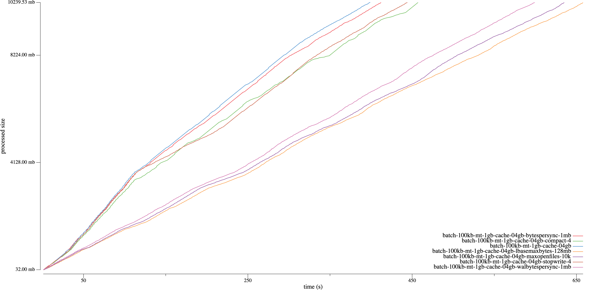

From the results, it is evident that other configurations negatively impact write performance. Let's delve deeper into the read-write benchmark to provide a more comprehensive explanation.

### Conclusions

1. For write-heavy workloads, setting the MemTableSize to 1GB and the CacheSize to 4GB proves to be an effective configuration option. This combination has demonstrated notable performance benefits, particularly in scenarios involving large-scale data ingestion and processing.
2. Pebble's performance degradation as the dataset size increases, this may be attributed to the structural of LSM and compaction behaviours.

## Read benchmarks

Next, we need to measure the read performance of all the read metrics.

Here, we first need to test the real PebbleDB workload in geth, so we use the `geth import` command to import the Ethereum blockchain data, and collect the pebble's read and write metrics with Prometheus,
refer to https://github.com/jsvisa/go-ethereum/blob/db-metrics/ethdb/pebble/pebble.go#L38-L63.

The below grafana dashboard shows the read and write performace of PebbleDB in geth:

> Pebble Read/Write Count(QPS)

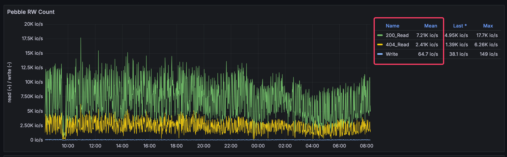

> Pebble Read/Write Time

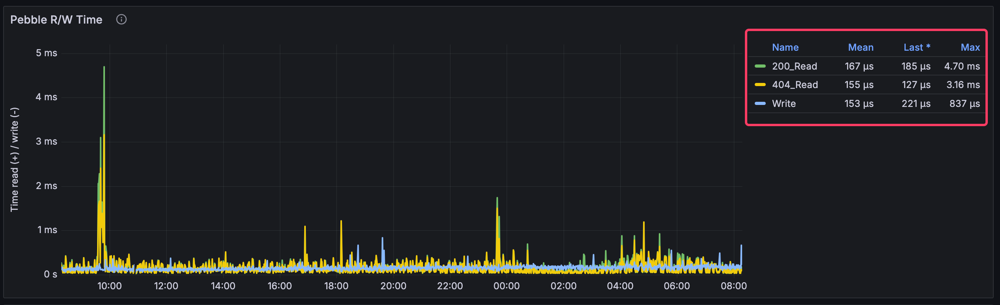

From the dashboard, we observe that the mean read count is 8650 qps, while the mean write count is 60 qps. This suggests that read operations are significantly more frequent than write operations. 

Moreover, the maximum read time is considerably **higher** than the maximum write time. Given the higher frequency and longer duration of read operations, it is clear that read performance has a substantial impact on overall system efficiency. 

Therefore, we need to prioritize and invest more effort into optimizing and refining our read benchmarks.

To begin our evaluation, we started with some foundational test cases. For the read test cases, we first wrote 10GB of data into Pebble to establish a consistent dataset. We then used this dataset to test various read configurations and options. This approach allows us to assess the performance of different read scenarios using the same baseline data, ensuring that our results are directly comparable and meaningful:

1. random-read: with pebble's default options
2. random-read-filter: set Level0 filter policy
3. random-read-bigcache: set 10GB cache size
4. random-read-bigcache-filter: set 10GB cache size + Level0 filter policy
5. pebble-read: with [cmd/pebble/db.go](https://github.com/cockroachdb/pebble/blob/12f37e4409a40a31c1700369d6630b168960afcc/cmd/pebble/db.go#L57-L132)'s configuration and 1GB cache

The results as below [datasets/pebble-read](datasets/pebble-read):

| Benchmark                   | Time          | Mean MB/s        |
| --------------------------- | ------------- | ---------------- |
| random-read                 | 1368.8028s    | 0.755 (+- 0.210) |
| random-read-filter          | 920.3574s     | 1.122 (+- 0.141) |
| random-read-bigcache        | 768.5698s     | 1.344 (+- 0.175) |
| random-read-bigcache-filter | 765.6756s     | 1.349 (+- 0.186) |
| pebble-read                 | **262.4652s** | 3.934 (+- 1.183) |

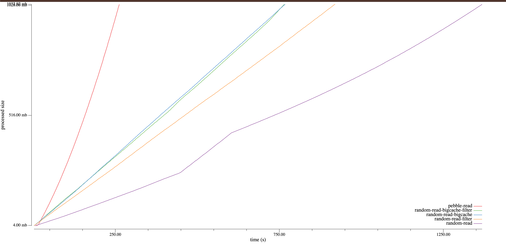

General Observations:

1. The `bigcache` 's perfromance outperforms the default cache size(8MB).
2. The `cmd/pebble`'s read performace exhibits superior read performance compared to other configurations.
3. The performance impact of the Bloom filter is not substantial, suggesting that its benefits may be limited in certain scenarios.

Next, let's test the same dbsize with different cache size:

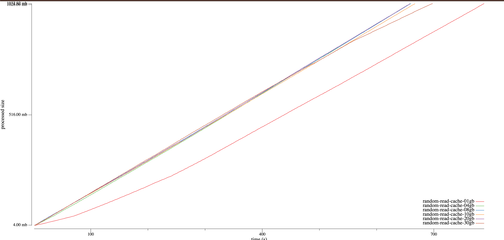

From the dashboard, it is evident that, aside from the 1GB cache, the performance of other configurations is relatively similar.

To evaluate the read performance of Pebble across various database sizes, we conducted tests using the   `pebble-read`  testcase with the following database sizes:

- 10gb
- 50gb
- 100gb
- 500gb

The results as below [datasets/pebble-read-varsize](./datasets/pebble-read-varsize):

| Benchmark | Time          | Mean MB/s        |
| --------- | ------------- | ---------------- |
| 10gb      | **168.9991s** | 6.109 (+- 0.641) |
| 50gb      | 872.3630s     | 1.184 (+- 1.026) |
| 100gb     | 2190.7516s    | 0.471 (+- 0.155) |
| 500gb     | 4959.1215s    | 0.208 (+- 0.031) |

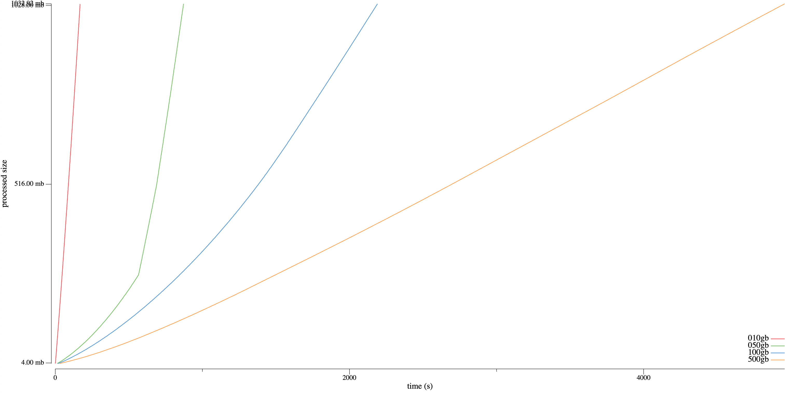

From the dashboard, as the database size increases, the read performance tends to deteriorate. This may be because the 1GB cache size is insufficient to effectively manage large datasets. 

To better understand the impact of cache size on performance, we need to conduct tests with larger cache size. We will perform a series of tests on a 100GB database size, using different cache sizes to evaluate their impact on read performance. 

The cache sizes selected for this test as below [datasets/pebble-read-varcache](datasets/pebble-read-varcache):

| Benchmark              | Time         | Mean MB/s        |
| ---------------------- | ------------ | ---------------- |
| pebble-read-cache-01gb | 676.4256s    | 0.310 (+- 0.068) |
| pebble-read-cache-04gb | 69.7442s     | 3.004 (+- 0.326) |
| pebble-read-cache-08gb | 64.4894s     | 3.249 (+- 0.349) |
| pebble-read-cache-10gb | 61.6154s     | 3.400 (+- 0.386) |
| pebble-read-cache-20gb | 59.2755s     | 3.535 (+- 0.426) |
| pebble-read-cache-30gb | **58.7969s** | 3.563 (+- 0.451) |

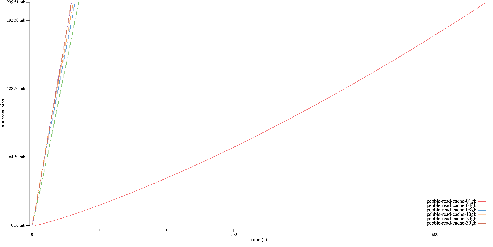

From the dashboard, it is evident that, aside from the 1GB cache, the read performance of other cache sizes is satisfactory. Moreover, as the cache size increases, read performance improves. However, the extent of improvement is limited. Therefore, it is necessary to conduct tests with larger databases, such as 500GB and 1TB, to determine whether further increasing the cache size will continue to enhance performance.
