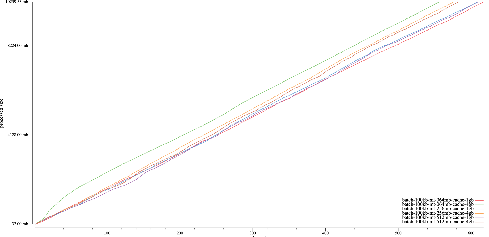
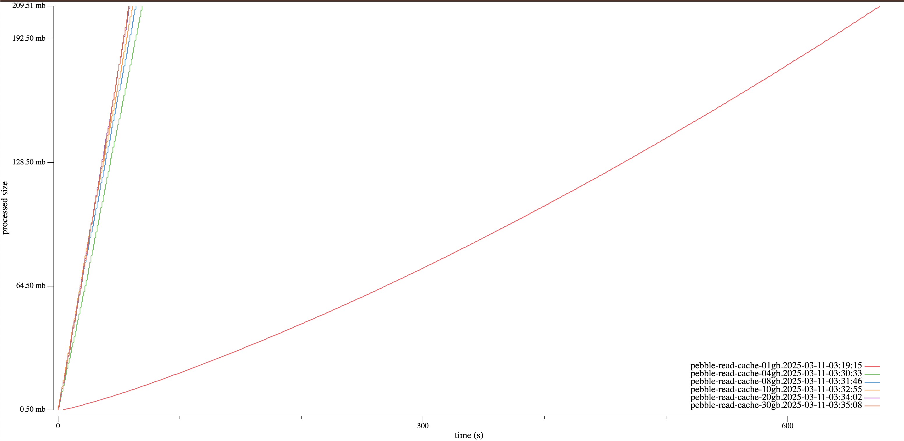

# Pebble read/write benchmarks

## hardware

CPU: AMD Ryzen 7 5700G with Radeon Graphics

Memory: 64GB

Disk: Samsung SSD 990 EVO Plus 4TB

### Disk benchmark results

## Write benchmarks

[pdb-writebench](./cmd/pdb-writebench) is a tool to benchmark the write performance of Pebble, it can generate a dataset with a specified size and run the write benchmarks with different configurations, based on [ldb-writebench](./cmd/ldb-writebench),
the usage is similar to `ldb-writebench`, while integrating with Prometheus metrics for enhanced monitoring and analysis.

We will utilize the pebble write benchmarks to evaluate the optimal write configuration using a small dataset (e.g., 5GB).

After the benchmark, we generate the write benchmark results with the following command:

```bash
ldb-benchstat datasets/pebble-write-test/*.json
```

Write benchmarks results as below:

> The `concurrent` and `nobatch` testcases are too slow, ignore them

| Benchmark                             | Time        | Mean MB/s          |
| ------------------------------------- | ----------- | ------------------ |
| concurrent                            | 20516.2521s | 0.173 (+- 0.027)   |
| batch-1mb                             | 1227.5405s  | 4.171 (+- 3.888)   |
| batch-100kb                           | 811.8186s   | 6.307 (+- 5.541)   |
| batch-100kb-nosync                    | 709.8882s   | 7.212 (+- 20.037)  |
| nobatch-nosync                        | 677.9506s   | 7.552 (+- 15.625)  |
| batch-5mb                             | 474.8282s   | 10.783 (+- 11.616) |
| batch-100kb-wb-512mb-cache-1gb        | 389.9965s   | 13.128 (+- 4.603)  |
| batch-100kb-wb-4gb-cache-32gb-nosync  | 213.8393s   | 23.943 (+- 9.150)  |
| batch-100kb-wb-4gb-cache-16gb-nosync  | 204.3798s   | 25.051 (+- 9.517)  |
| batch-100kb-wb-1gb-cache-1gb-nosync   | 195.7156s   | 26.160 (+- 12.967) |
| batch-100kb-wb-512mb-cache-4gb-nosync | 180.1895s   | 28.414 (+- 15.110) |
| batch-100kb-wb-512mb-cache-1gb-nosync | 173.5529s   | 29.501 (+- 15.531) |

General Observations:

- Concurrent without batching is the slowest write benchmark, so if we need to write data concurrently, we should use batching instead of multiple goroutines.
- Performance improvement with caching and No Sync, the benchmarks show a significant improvement in performance when using caching and disabling sync operations.
- Cache size is not the larger the better, the benchmarks show that 1gb cache is faster than 4gb or higher cache, but I'm not sure why this happens.

As a result, the best write configuration is `batch-100kb-wb-512mb-cache-1gb-nosync` we try to test with a larger dataset to see if the result is consistent.

### write 10gb with different memeory table size

Testing with 10GB data and 1GB cache, with different memory table size:

```bash
pdb-writebench -size 10gb -logdir testdb-pebble/write -dir /md0/pebble-write-test-10gb -test \
    batch-100kb-mt-004mb-cache-1gb, \
    batch-100kb-mt-008mb-cache-1gb, \
    batch-100kb-mt-016mb-cache-1gb, \
    batch-100kb-mt-064mb-cache-1gb, \
    batch-100kb-mt-256mb-cache-1gb, \
    batch-100kb-mt-512mb-cache-1gb \
-deletedb
```

The results are as follows:


| Benchmark | Time      | Mean MB/s          |
| --------- | --------- | ------------------ |
| 004mb-1gb | 900.6142s | 11.369 (+- 12.098) |
| 008mb-1gb | 800.9128s | 12.785 (+- 8.399)  |
| 016mb-1gb | 711.1493s | 14.399 (+- 7.751)  |
| 064mb-1gb | 617.7583s | 16.575 (+- 6.991)  |
| 256mb-1gb | 609.0662s | 16.812 (+- 7.030)  |
| 512mb-1gb | 610.2748s | 16.779 (+- 6.865)  |

General Observations:

1. The write performance increases with the memory table size
2. When the memory table size is bigger than `cache/16` or 64MB, the performance is stable

Then we test with 1GB memory table size, to see if the memory table size too large will occured the write performance:


| Benchmark | Time      | Mean MB/s         |
| --------- | --------- | ----------------- |
| 064mb-1gb | 617.7583s | 16.575 (+- 6.991) |
| 256mb-1gb | 609.0662s | 16.812 (+- 7.030) |
| 512mb-1gb | 610.2748s | 16.779 (+- 6.865) |
| 1gb-1gb   | 550.5742s | 18.598 (+- 6.892) |
| 1gb-4gb   | 399.2230s | 25.649 (+- 8.416) |

General Observations:

1. 1GB memory table size is better than 64MB
2. Larger cache size will increase the write performance

Then we test with 10GB data, 4GB cache and with 64,256,512 MB memory table size to see if the memory table size should be adjusted with the cache size.



| Benchmark | Time      | Mean MB/s         |
| --------- | --------- | ----------------- |
| 064mb-1gb | 617.7583s | 16.575 (+- 6.991) |
| 064mb-4gb | 556.7056s | 18.393 (+- 7.865) |
| 256mb-1gb | 609.0662s | 16.812 (+- 7.030) |
| 256mb-4gb | 576.0965s | 17.774 (+- 6.565) |
| 512mb-1gb | 610.2748s | 16.779 (+- 6.865) |
| 512mb-4gb | 582.9096s | 17.566 (+- 6.643) |

General Observations:

1. Memory table size should be adjusted to 64MB, no matter the cache size is 1GB or 4GB.
2. Larger cache size will increase the write performance

Then let's test with large cache size of 8g, 16g, 32g:


| Benchmark | Time      | Mean MB/s         |
| --------- | --------- | ----------------- |
| 1gb-01gb  | 550.5742s | 18.598 (+- 6.892) |
| 1gb-04gb  | 399.2230s | 25.649 (+- 8.416) |
| 1gb-08gb  | 400.9613s | 25.537 (+- 8.615) |
| 1gb-16gb  | 585.3147s | 17.494 (+- 5.653) |
| 1gb-32gb  | 588.2271s | 17.407 (+- 6.088) |
| 2gb-08gb  | 613.2042s | 16.698 (+- 4.482) |
| 2gb-16gb  | 625.9508s | 16.358 (+- 4.745) |
| 2gb-32gb  | 629.0496s | 16.278 (+- 4.739) |
| 4gb-08gb  | 450.8799s | 22.710 (+- 8.495) |
| 4gb-16gb  | 591.0455s | 17.324 (+- 3.462) |
| 4gb-32gb  | 609.8514s | 16.790 (+- 3.942) |

General Observations:

1. Cache size is not the bigger the better, 4GB and 8GB is a proper good option

Then let's test with a larger dataset (100GB)


| Benchmark | Time       | Mean MB/s         |
| --------- | ---------- | ----------------- |
| 1gb-04gb  | 6559.6107s | 15.611 (+- 6.965) |
| 1gb-08gb  | 7074.2569s | 14.475 (+- 5.960) |
| 4gb-16gb  | 7292.5680s | 14.042 (+- 5.088) |
| 4gb-32gb  | 7479.5316s | 13.691 (+- 5.038) |

General Observations:

1. The result is similar to the 10GB dataset, the cache size is not the bigger the better, 4GB and 8GB is a proper good option

Let's test with other write related options:

1. MemTableStopWritesThreshold: stop write if sum(memtable size) > MemTableStopWritesThreshold \* MemTableSize, default is 2
2. MaxConcurrentCompactions: default is 1
3. BytesPerSync: sync sstables periodically in order to smooth out writes to disk, default 512KB
4. WALBytesPerSync: sets the number of bytes to write to a WAL before calling Sync on it in the background, default is 0, no background sync
5. MaxOpenFiles: default is 1000
6. LBaseMaxBytes: the maximum number of bytes for LBase. The base level is the level which L0 is compacted into. default is 64MB


From the results, we can see those other options are bad to the write performance, let's explain more on the read-write benchmark.

### Conclusions

1. For write heave workloads, set with 1GB MemTableSize and 4GB CacheSize is a better options
2. Pebble's write performance is stable on the written data size, no matter it's 10GB or 100GB

## Read benchmarks

Next, we need to measure the read performance of all the read metrics.

Here, we first need to test the real PebbleDB workload in geth, so we use the `geth import` command to import the Ethereum blockchain data, and collect the pebble's read and write metrics with Prometheus,
refer to https://github.com/jsvisa/go-ethereum/blob/db-metrics/ethdb/pebble/pebble.go#L38-L63.

The below grafana dashboard shows the read and write performace of PebbleDB in geth:

> Pebble Read/Write Count(QPS)


> Pebble Read/Write Time


From the dashboard, we can see the mean read count is 8650, while the mean write count is 60, which is much higher than the write case, and the mean read time is similar to the write time, so we need to put more effort into the read benchmarks.

We start with some simple testcases, for the read testcases, we first write 10GB data into the pebble, and then reuse this dataset to test different read options:

1. random-read: with pebble's default options
2. random-read-filter: set Level0 filter policy
3. random-read-bigcache: set 10GB cache size
4. random-read-bigcache-filter: set 10GB cache size + Level0 filter policy
5. pebble-read: with [cmd/pebble/db.go](https://github.com/cockroachdb/pebble/blob/12f37e4409a40a31c1700369d6630b168960afcc/cmd/pebble/db.go#L57-L132)'s configuration

The results as below:


General Observations:

1. the `bigcache` 's perfromance is way better than the default cache size(8MB) 
2. cmd/pebble's read performace is better then the others

Next, let's test the same dbsize with different cache size:


Except for the 1gb cache, the others performace are similar.

Let's test with the pebble-read testcase for different db size:

- 10gb
- 50gb
- 100gb
- 500gb

The result as below:


The larger the db is, the read performace is worse, we need to test with a more larger db instead.


Test on a 100GB dbsize with different cache size:



Excpet for the 1GB cache, the other's read performace are good, and the larger the cache size, the better read performnce 
