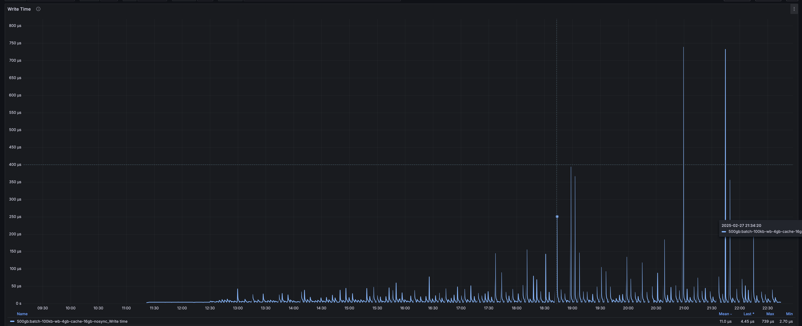

# Pebble read/write benchmarks

## hardware

CPU: AMD Ryzen 7 5700G with Radeon Graphics

Memory: 64GB

Disk: Samsung SSD 990 EVO Plus 4TB

### Disk benchmark results

## Write benchmarks

[pdb-writebench](./cmd/pdb-writebench) is a tool to benchmark the write performance of Pebble, it can generate a dataset with a specified size and run the write benchmarks with different configurations, based on [ldb-writebench](./cmd/ldb-writebench),
the usage is similar to `ldb-writebench`, while integrating with Prometheus metrics for enhanced monitoring and analysis.

We will utilize the pebble write benchmarks to evaluate the optimal write configuration using a small dataset (e.g., 5GB).

```bash
pdb-writebench -size 5gb -logdir datasets/pebble-write-test -prefix 5gb: -test batch-100kb,batch-100kb-nosync,batch-100kb-wb-1gb-cache-1gb-nosync,batch-100kb-wb-4gb-cache-16gb-nosync,batch-100kb-wb-4gb-cache-32gb-nosync,batch-100kb-wb-512mb-cache-1gb,batch-100kb-wb-512mb-cache-1gb-nosync,batch-100kb-wb-512mb-cache-4gb-nosync,batch-1mb,batch-5mb,concurrent,nobatch,nobatch-nosync -dir /md0/pebble-write-test -keydir /md2/pebble-write-test-key
```

After the benchmark, we generate the write benchmark results with the following command:

```bash
ldb-benchstat datasets/pebble-write-test/*.json
```

Write benchmarks results as below:

> The `concurrent` and `nobatch` testcases are too slow, ignore them

| Benchmark                             | Time        | Mean MB/s          |
| ------------------------------------- | ----------- | ------------------ |
| concurrent                            | 20516.2521s | 0.173 (+- 0.027)   |
| batch-1mb                             | 1227.5405s  | 4.171 (+- 3.888)   |
| batch-100kb                           | 811.8186s   | 6.307 (+- 5.541)   |
| batch-100kb-nosync                    | 709.8882s   | 7.212 (+- 20.037)  |
| nobatch-nosync                        | 677.9506s   | 7.552 (+- 15.625)  |
| batch-5mb                             | 474.8282s   | 10.783 (+- 11.616) |
| batch-100kb-wb-512mb-cache-1gb        | 389.9965s   | 13.128 (+- 4.603)  |
| batch-100kb-wb-4gb-cache-32gb-nosync  | 213.8393s   | 23.943 (+- 9.150)  |
| batch-100kb-wb-4gb-cache-16gb-nosync  | 204.3798s   | 25.051 (+- 9.517)  |
| batch-100kb-wb-1gb-cache-1gb-nosync   | 195.7156s   | 26.160 (+- 12.967) |
| batch-100kb-wb-512mb-cache-4gb-nosync | 180.1895s   | 28.414 (+- 15.110) |
| batch-100kb-wb-512mb-cache-1gb-nosync | 173.5529s   | 29.501 (+- 15.531) |

General Observations:

- Concurrent without batching is the slowest write benchmark, so if we need to write data concurrently, we should use batching instead of multiple goroutines.
- Performance improvement with caching and No Sync, the benchmarks show a significant improvement in performance when using caching and disabling sync operations.
- Cache size is not the larger the better, the benchmarks show that 1gb cache is faster than 4gb or higher cache, but I'm not sure why this happens.

As a result, the best write configuration is `batch-100kb-wb-4gb-cache-16gb-nosync` with 25.051 MB/s and a smaller std deviation, so we try to test with a larger dataset to see if the result is consistent.

```bash
mkdir -p datasets/pebble/
for size in 1 10 50 100 500; do
    pdb-writebench -size ${size}gb -logdir datasets/pebble/pb-${size}gb -prefix ${size}gb: -test batch-100kb-wb-4gb-cache-16gb-nosync -dir /md0/pebble/pb-data-${size}gb -keydir /md1/pb-data-${size}gb-key
done
```

The write results are as follows:

| Benchmark | Time        | Mean MB/s          |
| --------- | ----------- | ------------------ |
| 1gb       | 32.5504s    | 31.448 (+- 10.992) |
| 10gb      | 447.7099s   | 22.872 (+- 7.391)  |
| 50gb      | 2270.9244s  | 22.546 (+- 6.634)  |
| 100gb     | 4587.8367s  | 22.320 (+- 6.873)  |
| 500gb     | 40861.1194s | 12.530 (+- 12.231) |

As the dataset size increases, the write performance decreases. For the 500gb testcase, let's see the write time collected by Prometheus in grafana:



We can see the write time is not stable, as the dataset increases, the maximum write time is 67 times bigger than the mean one, this maybe caused by the compaction process.

**TODO:**

1. Pebble has itself benchmark tool `pebble bench`, we can use it to test the write performance as well.
2. Adjust the other options for the write benchmark to see if there is a better configuration, eg: open files, L0 and other levels configuration.

### write 10gb with different memeory table size

Testing with 10GB data and 1GB cache, with different memory table size:

```bash
pdb-writebench -size 10gb -logdir testdb-pebble/write -dir /md0/pebble-write-test-10gb -test \
    batch-100kb-mt-004mb-cache-1gb, \
    batch-100kb-mt-008mb-cache-1gb, \
    batch-100kb-mt-016mb-cache-1gb, \
    batch-100kb-mt-064mb-cache-1gb, \
    batch-100kb-mt-256mb-cache-1gb, \
    batch-100kb-mt-512mb-cache-1gb \
-deletedb
```

The results are as follows:


| Benchmark | Time      | Mean MB/s          |
| --------- | --------- | ------------------ |
| 004mb-1gb | 900.6142s | 11.369 (+- 12.098) |
| 008mb-1gb | 800.9128s | 12.785 (+- 8.399)  |
| 016mb-1gb | 711.1493s | 14.399 (+- 7.751)  |
| 064mb-1gb | 617.7583s | 16.575 (+- 6.991)  |
| 256mb-1gb | 609.0662s | 16.812 (+- 7.030)  |
| 512mb-1gb | 610.2748s | 16.779 (+- 6.865)  |

General Observations:

1. The write performance increases with the memory table size
2. When the memory table size is bigger than `cache/16` or 64MB, the performance is stable

Then we test with 1GB memory table size, to see if the memory table size too large will occured the write performance:


| Benchmark | Time      | Mean MB/s         |
| --------- | --------- | ----------------- |
| 064mb-1gb | 617.7583s | 16.575 (+- 6.991) |
| 256mb-1gb | 609.0662s | 16.812 (+- 7.030) |
| 512mb-1gb | 610.2748s | 16.779 (+- 6.865) |
| 1gb-1gb   | 550.5742s | 18.598 (+- 6.892) |
| 1gb-4gb   | 399.2230s | 25.649 (+- 8.416) |

General Observations:

1. 1GB memory table size is better than 64MB
2. Larger cache size will increase the write performance

Then we test with 10GB data, 4GB cache and with 64,256,512 MB memory table size to see if the memory table size should be adjusted with the cache size.


| Benchmark | Time      | Mean MB/s         |
| --------- | --------- | ----------------- |
| 064mb-1gb | 617.7583s | 16.575 (+- 6.991) |
| 064mb-4gb | 556.7056s | 18.393 (+- 7.865) |
| 256mb-1gb | 609.0662s | 16.812 (+- 7.030) |
| 256mb-4gb | 576.0965s | 17.774 (+- 6.565) |
| 512mb-1gb | 610.2748s | 16.779 (+- 6.865) |
| 512mb-4gb | 582.9096s | 17.566 (+- 6.643) |

General Observations:

1. Memory table size should be adjusted to 64MB, no matter the cache size is 1GB or 4GB.
2. Larger cache size will increase the write performance

Then let's test with large cache size of 8g, 16g, 32g:


| Benchmark | Time      | Mean MB/s         |
| --------- | --------- | ----------------- |
| 1gb-01gb  | 550.5742s | 18.598 (+- 6.892) |
| 1gb-04gb  | 399.2230s | 25.649 (+- 8.416) |
| 1gb-08gb  | 400.9613s | 25.537 (+- 8.615) |
| 1gb-16gb  | 585.3147s | 17.494 (+- 5.653) |
| 1gb-32gb  | 588.2271s | 17.407 (+- 6.088) |
| 2gb-08gb  | 613.2042s | 16.698 (+- 4.482) |
| 2gb-16gb  | 625.9508s | 16.358 (+- 4.745) |
| 2gb-32gb  | 629.0496s | 16.278 (+- 4.739) |
| 4gb-08gb  | 450.8799s | 22.710 (+- 8.495) |
| 4gb-16gb  | 591.0455s | 17.324 (+- 3.462) |
| 4gb-32gb  | 609.8514s | 16.790 (+- 3.942) |

General Observations:

1. Cache size is not the bigger the better, 4GB and 8GB is a proper good option

TODO: test with a larger dataset (100GB)

## Read benchmarks

We need to test the real PebbleDB workload in geth, so we use the `geth import` command to import the Ethereum blockchain data, and collect the pebble's read and write metrics with Prometheus,
refer to https://github.com/jsvisa/go-ethereum/blob/db-metrics/ethdb/pebble/pebble.go#L38-L63.

The below grafana dashboard shows the read and write performace of PebbleDB in geth:

> Pebble Read/Write Count(QPS)


> Pebble Read/Write Time


From the dashboard, we can see the mean read count is 8650, while the mean write count is 60, which is much higher than the write case, and the mean read time is similar to the write time, so we need to put more effort into the read benchmarks.

TODO

```

```
